# TemporalModelR

TemporalModelR is an R package for building temporally explicit species
distribution models using hypervolume-based methods. The package
provides a complete workflow from data preprocessing through model
building, prediction, and temporal pattern analysis.

## Overview

TemporalModelR enables researchers to:

- **Preprocess spatial and temporal occurrence data** with
  spatiotemporal rarefication
- **Extract and scale environmental variables** matched to temporal
  occurrence records
- **Build hypervolume models** using Gaussian kernel density or
  one-class SVM methods
- **Generate spatiotemporal predictions** with comprehensive model
  evaluation metrics
- **Analyze temporal patterns** in habitat suitability using changepoint
  detection
- **Summarize trends by spatial units** for regional conservation
  assessments

## Installation

You can install the development version of TemporalModelR from
[GitHub](https://github.com/) with:

``` r
# install.packages("pak")
pak::pak("CJHughes926/TemporalModelR")
```

## Workflow Overview

The TemporalModelR workflow consists of three main phases:

### 1. Preprocessing

- Align environmental rasters to a common projection and extent
- Rarefy occurrence data to reduce spatial and temporal bias
- Extract environmental values at occurrence locations
- Scale environmental rasters for model training

### 2. Modeling

- Partition occurrence data into spatiotemporal cross-validation folds
- Build hypervolume models for each fold
- Generate predictions across space and time
- Evaluate model performance in geographic and environmental space

### 3. Postprocessing

- Summarize predictions into consensus binary outputs
- Identify temporal patterns (increasing, decreasing, stable,
  fluctuating)
- Analyze trends by spatial units (e.g., counties, states, watersheds)

## Example Workflow: DC Metro Region Analysis

This example demonstrates the complete workflow using bird occurrence
data from the DC Metro region (1985-2023). The preprocessing and
modeling steps are computationally intensive and are shown with
`eval=FALSE` for documentation purposes.

``` r
library(TemporalModelR)
library(terra)
library(sf)
library(raster)
```

### Phase 1: Preprocessing

#### Step 1: Prepare Reference Raster and Study Area

Create a reference raster for your study area:

``` r
counties_path <- "./DC_Metro/Shapefiles/DCMetro_Counties.shp"
reference_raster <- "./DC_Metro/reverse_water_mask_DCMetro.tif"

r <- raster(reference_raster)
counties <- st_read(counties_path)

loudoun <- counties[counties$NAMELSAD %in% c("Loudoun County", "Montgomery County"), ]

if (st_crs(loudoun) != crs(r)) {
  loudoun <- st_transform(loudoun, crs(r))
}

r_loudoun <- crop(r, loudoun)
r_loudoun <- mask(r_loudoun, loudoun)

Loudoun_Montgomery <- aggregate(r_loudoun, fact = 9, fun = mean, na.rm = TRUE)
```

#### Step 2: Align Environmental Rasters

Align all environmental rasters to match your reference raster’s
projection, extent, and resolution:

``` r
raster_align(
  input_dir = "G:/My Drive/VS_Rasters/DC_Metro/",
  output_dir = "G:/My Drive/VS_Rasters/DC_Metro/Masked_Projected_Variables_Simple/",
  reference_raster = Loudoun_Montgomery,
  overwrite = F
)
```

#### Step 3: Rarefy Occurrence Data

Reduce spatial and temporal bias in your occurrence data:

``` r
spatiotemporal_rarefication(
  points_sp = "./DC_Metro/Occurrence_Data/simple_occupied_DC_Metro_AOU_5010.csv",
  xcol = "LONGDD",
  ycol = "LATDD",
  points_crs = 4326,
  output_dir = "./DC_Metro/Occurrence_Data/",
  reference_raster = Loudoun_Montgomery,
  time_cols = "Year"
)
```

This creates `Pts_Database_OnePerPixPerTimeStep.csv` with
spatiotemporally rarefied occurrences.

#### Step 4: Extract Environmental Values

Extract environmental values at occurrence locations, calculating
scaling parameters:

``` r
variable_patterns <- c(
  "Developed_Percentage2" = "Developed_Percentage2_YEAR",
  "Open_Percentage2" = "Open_Percentage2_YEAR",
  "Forest_Percentage2" = "Forest_Percentage2_YEAR",
  "elevation" = "elevation"
)

temporally_explicit_extraction(
  points_sp = "./DC_Metro/Occurrence_Data/Pts_Database_OnePerPixPerTimeStep.csv",
  xcol = "X",
  ycol = "Y",
  points_crs = 4326,
  raster_dir = "G:/My Drive/VS_Rasters/DC_Metro/Masked_Projected_Variables_Simple/",
  variable_patterns = variable_patterns,
  time_cols = "Year",
  output_dir = "./DC_Metro/Occurrence_Data/",
  output_prefix = "temp_explicit_df"
)
```

The function matches land cover rasters to occurrence years (e.g.,
`Developed_Percentage2_1990.tif` for 1990 occurrences), while static
variables like elevation are extracted once.

#### Step 5: Scale Environmental Rasters

Standardize all environmental rasters using the scaling parameters from
your occurrence data:

``` r
scale_rasters(
  input_dir = "G:/My Drive/VS_Rasters/DC_Metro/Masked_Projected_Variables_Simple/",
  output_dir = "G:/My Drive/VS_Rasters/DC_Metro/Scaled_simple/",
  scaling_params_file = "./DC_Metro/Occurrence_Data/temp_explicit_df_Scaling_Parameters.csv",
  variable_patterns = variable_patterns,
  time_cols = "Year",
  overwrite = T
)
```

### Phase 2: Modeling

#### Step 6: Create Spatiotemporal Cross-Validation Folds

Partition occurrences into spatially and temporally independent folds:

``` r
partition_results <- spatiotemporal_partition(
  reference_shapefile_path = st_geometry(loudoun),
  points_file_path = "./DC_Metro/Occurrence_Data/temp_explicit_df_Scaled_Values.csv",
  time_col = "Year",
  xcol = "x",
  ycol = "y",
  points_crs = 4326,
  total_folds = 4,
  n_temporal = 2,
  n_spatial = 8,
  blocking_priority = "balanced",
  max_imbalance = 0.025,
  generate_plots = TRUE,
  output_file = "./DC_Metro/Model_Results/partitioning_results_spatial.rds"
)
```

<div class="figure">

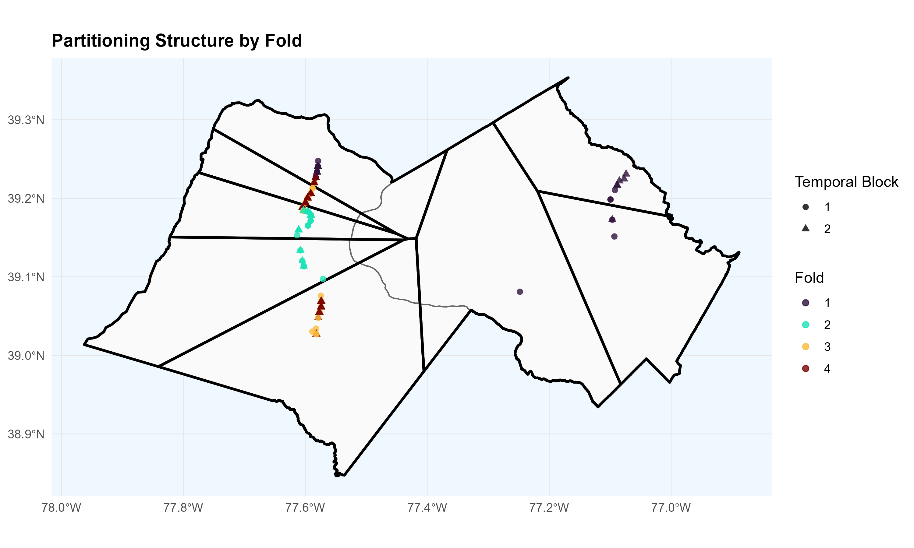
<p class="caption">
Spatiotemporal partition showing fold distribution across space and time
</p>

</div>

#### Step 7: Build Hypervolume Models

Construct Gaussian hypervolumes for each cross-validation fold:

``` r
hv_results <- build_hypervolume_models(
  partition_results = "./DC_Metro/Model_Results/partitioning_results_spatial.rds",
  model_vars = c("Developed_Percentage2", "Open_Percentage2", "Forest_Percentage2"),
  method = "gaussian",
  output_dir = "./DC_Metro/Model_Results/Hypervolumes",
  hypervolume_params = list(
    quantile.requested = 0.95,
    quantile.requested.type = "probability"
  ),
  create_plot = TRUE,
  overwrite = TRUE
)
```

<div class="figure">

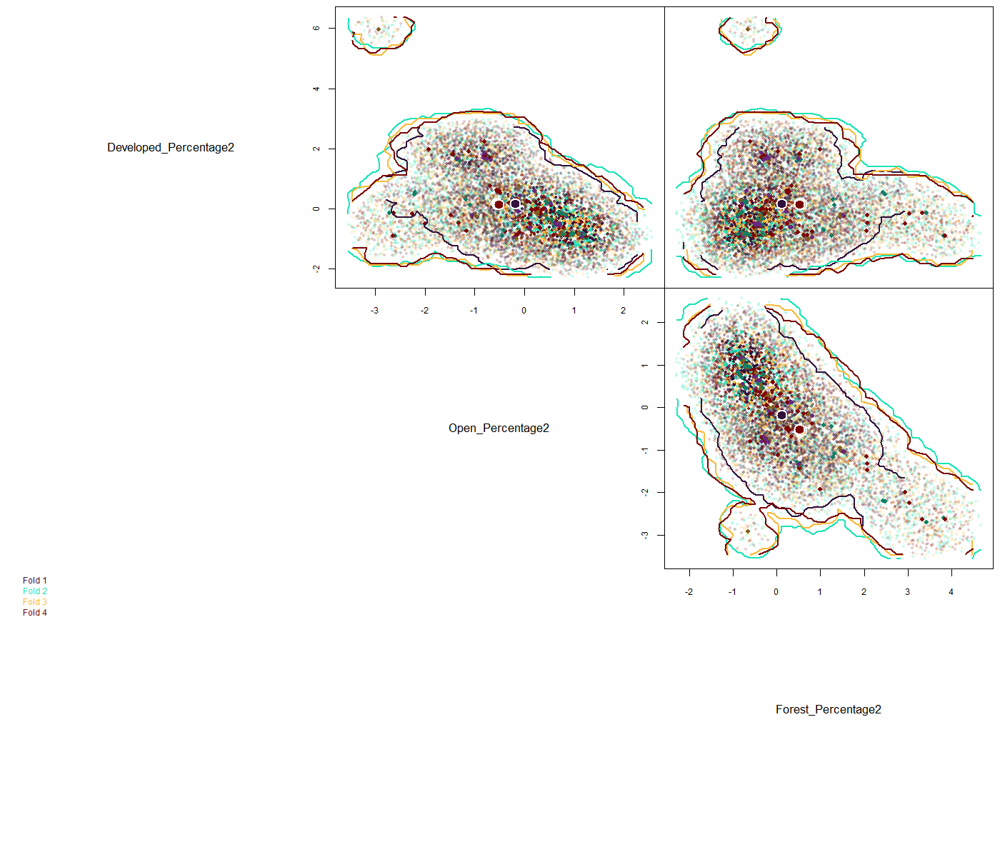
<p class="caption">
Hypervolume comparison across cross-validation folds
</p>

</div>

#### Step 8: Generate Spatiotemporal Predictions

Project hypervolumes across all years (1986-2023) to create habitat
suitability predictions:

``` r
time_steps <- 1986:2023

variable_patterns <- c(
  "Developed_Percentage2" = "Developed_Percentage2_YEAR",
  "Open_Percentage2" = "Open_Percentage2_YEAR",
  "Forest_Percentage2" = "Forest_Percentage2_YEAR"
)

predictions <- generate_spatiotemporal_predictions(
  partition_results = "./DC_Metro/Model_Results/partitioning_results_spatial.rds",
  hypervolume_results = "./DC_Metro/Model_Results/Hypervolumes/all_hypervolumes_gaussian.rds",
  time_col = "Year",
  time_steps = time_steps,
  variable_patterns = variable_patterns,
  raster_dir = "G:/My Drive/VS_Rasters/DC_Metro/Scaled_simple/",
  output_dir = "./DC_Metro/Model_Results/Predictions/",
  overwrite = FALSE
)
```

#### Step 9: Visualize Model Performance

Examine model evaluation metrics across the 38-year time series:

``` r
plot_model_assessment(
  data_file_path = "./DC_Metro/Model_Results/Predictions/Model_Assessment_Metrics.csv",
  time_column = "Year",
  separate_cbp = TRUE,
  cbp_threshold = 0.05
)
```

The `plot_model_assessment()` function generates diagnostic plots
showing model performance over time:

<div class="figure">

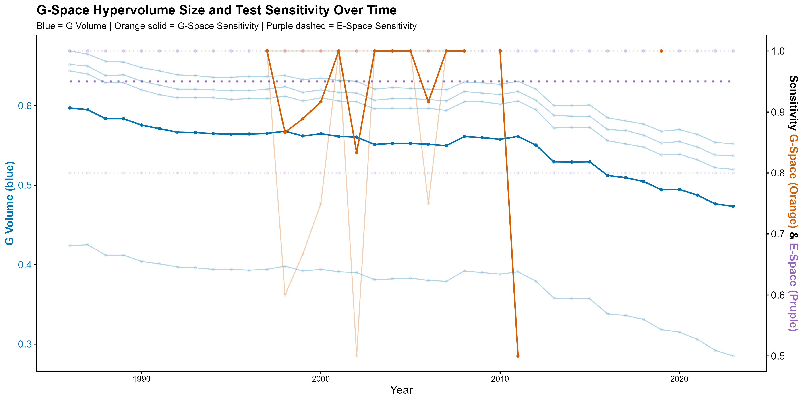
<p class="caption">
Hypervolume size and sensitivity metrics over time
</p>

</div>

<div class="figure">

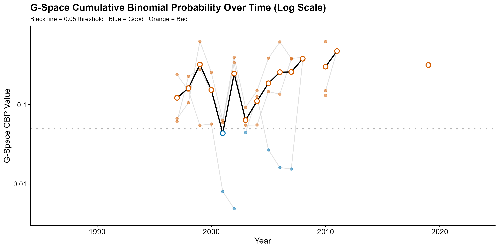
<p class="caption">
Continuous Binomial Probability in Geographic Space (G-space)
</p>

</div>

<div class="figure">

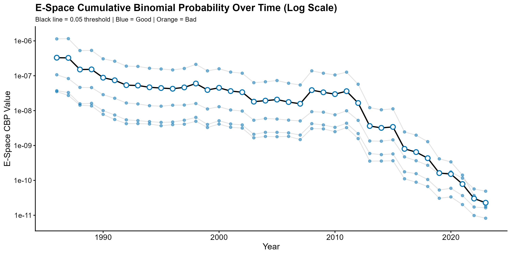
<p class="caption">
Continuous Binomial Probability in Environmental Space (E-space)
</p>

</div>

### Phase 3: Postprocessing

#### Step 10: Create Consensus Predictions

Summarize predictions across all models to identify areas of agreement:

``` r
summary_results <- summarize_raster_outputs(
  predictions_dir = "./DC_Metro/Model_Results/Predictions/",
  output_dir = "./DC_Metro/Model_Results/Summary",
  overwrite = TRUE
)
```

<div class="figure">

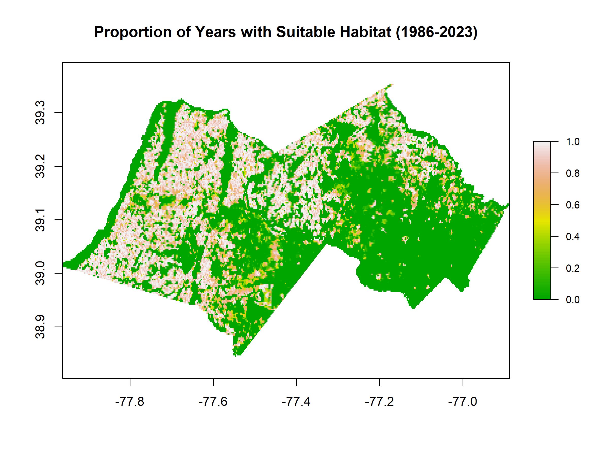
<p class="caption">
Summary raster showing proportion of years with suitable habitat
(1986-2023)
</p>

</div>

#### Step 11: Identify Temporal Patterns

Apply changepoint detection to classify pixels into temporal trend
categories:

``` r
time_steps <- 1986:2023

pattern_results <- analyze_temporal_patterns(
  binary_stack = summary_results$binary_stack,
  summary_raster = summary_results$summary_raster,
  time_steps = time_steps,
  fastcpd_params = list(method = "BIC"),
  output_dir = "./DC_Metro/Model_Results/Temporal_Patterns",
  spatial_autocorrelation = TRUE,
  n_tiles_x = 2,
  n_tiles_y = 2,
  show_progress = TRUE,
  estimate_time = TRUE,
  overwrite = TRUE
)
```

<div class="figure">

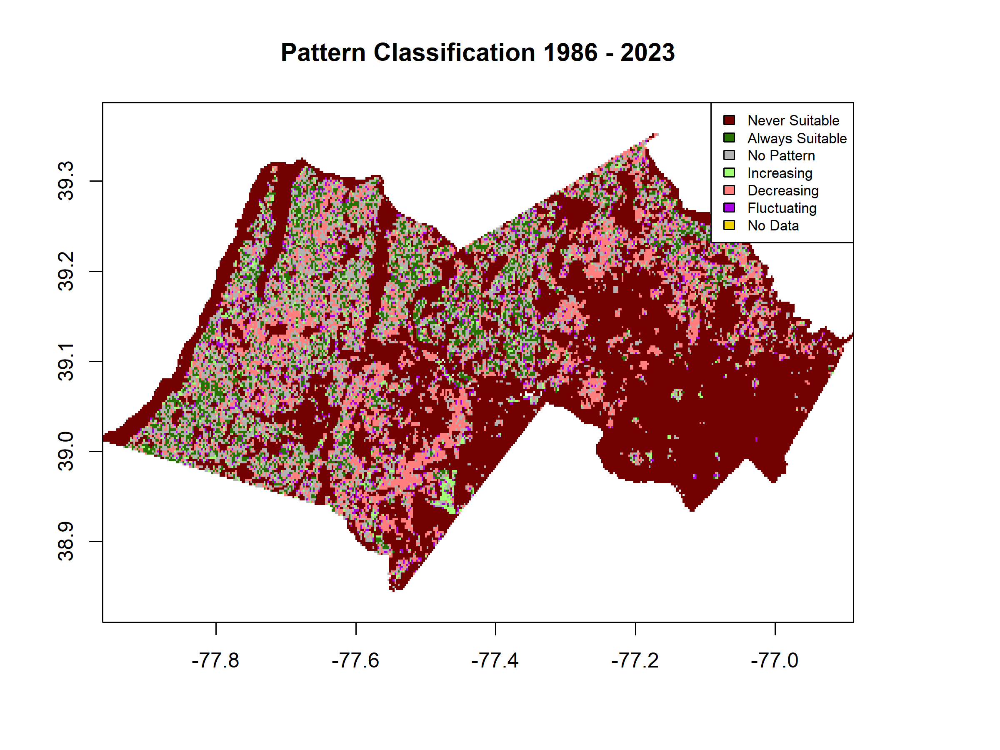
<p class="caption">
Temporal pattern classification showing habitat trends across the DC
Metro region
</p>

</div>

The classification identifies seven pattern types:

- **Never Suitable** (dark red): Areas that remained unsuitable
  throughout
- **Always Suitable** (dark green): Persistently suitable areas
- **No Pattern** (gray): Areas with stable conditions
- **Increasing** (light green): Areas gaining suitable habitat
- **Decreasing** (light red): Areas experiencing habitat loss
- **Fluctuating** (purple): Areas with complex temporal dynamics
- **No Data** (yellow): Areas outside the study region or lacking data

#### Step 12: Summarize by County

Aggregate temporal patterns and trends for administrative units:

``` r
analyze_trends_by_spatial_unit(
  shapefile_path = st_as_sf(loudoun),
  name_field = "NAMELSAD",
  binary_stack = summary_results$binary_stack,
  pattern_raster = "./DC_Metro/Model_Results/Temporal_Patterns/pattern_raster_1986_2023.tif",
  year_decrease_raster = "./DC_Metro/Model_Results/Temporal_Patterns/year_first_decrease_1986_2023.tif",
  year_increase_raster = "./DC_Metro/Model_Results/Temporal_Patterns/year_first_increase_1986_2023.tif",
  output_dir = "./DC_Metro/Model_Results/Spatial_Analysis",
  time_steps = time_steps,
  pie_scale = 0.5
)
```

The `analyze_trends_by_spatial_unit()` function generates comprehensive
spatial summaries:

<div class="figure">

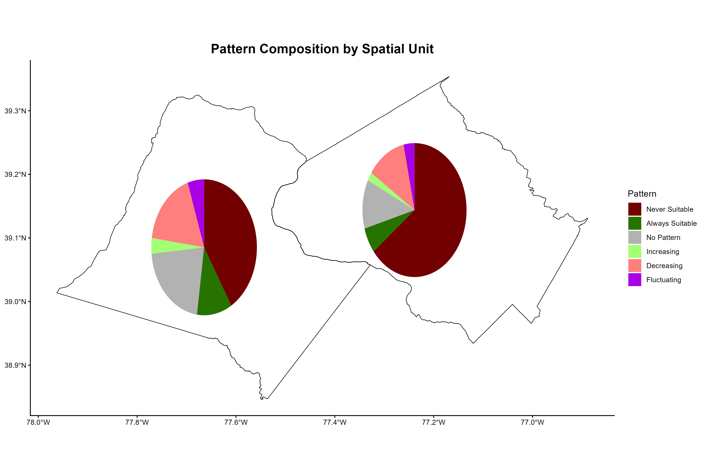
<p class="caption">
Pattern composition by county with pie charts showing temporal trend
distributions
</p>

</div>

<div class="figure">

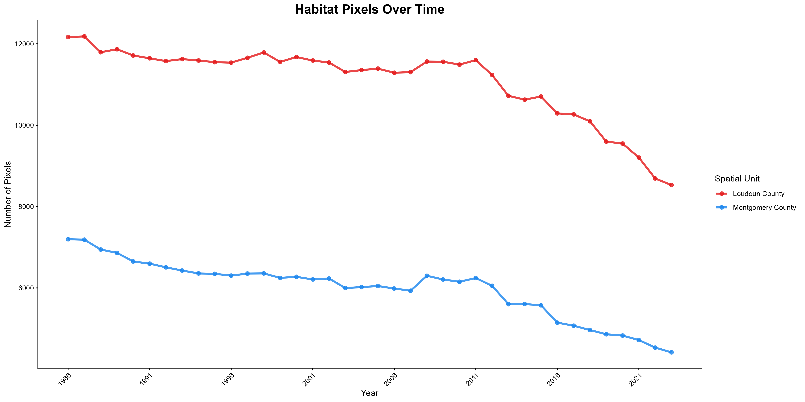
<p class="caption">
Habitat availability time series by county (1986-2023)
</p>

</div>

<div class="figure">

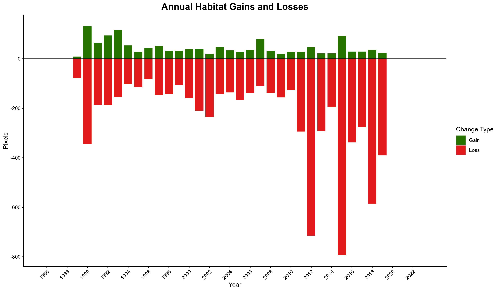
<p class="caption">
Annual habitat gains and losses across both counties
</p>

</div>

<div class="figure">

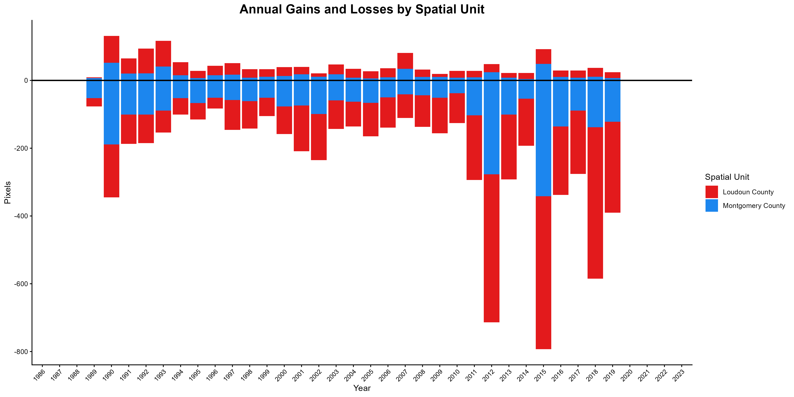
<p class="caption">
Gains and losses by county over time
</p>

</div>

<div class="figure">

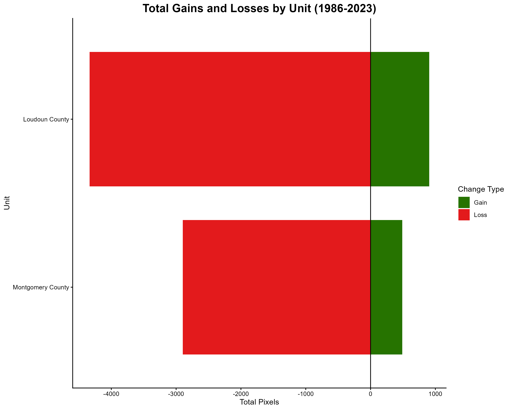
<p class="caption">
Total habitat change by county across the entire study period
</p>

</div>

<div class="figure">

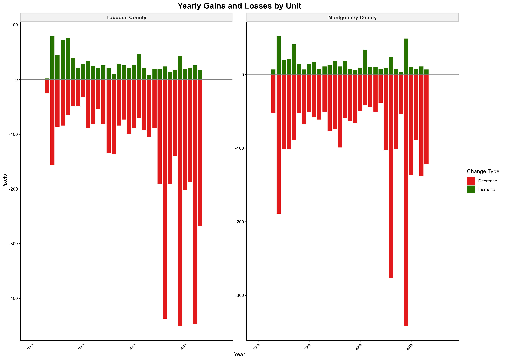
<p class="caption">
Faceted timeline showing temporal trends within each county
</p>

</div>

## Citation

If you use TemporalModelR in your research, please cite:

\[Citation information to be added\]

## Getting Help

- Report bugs or request features: [GitHub
  Issues](https://github.com/CJHughes926/TemporalModelR/issues)
- Ask questions: [GitHub
  Discussions](https://github.com/CJHughes926/TemporalModelR/discussions)

## License

\[License information to be added\]

## Acknowledgments

TemporalModelR builds on several excellent packages:

- [hypervolume](https://cran.r-project.org/package=hypervolume) for
  niche modeling
- [terra](https://cran.r-project.org/package=terra) for spatial data
  processing
- [sf](https://cran.r-project.org/package=sf) for vector spatial data
- [fastcpd](https://cran.r-project.org/package=fastcpd) for changepoint
  detection
- [exactextractr](https://cran.r-project.org/package=exactextractr) for
  spatial aggregation
