<!-- badges: start -->

[](https://github.com/CJHughes926/TemporalModelR/actions/workflows/R-CMD-check.yaml)
<!-- badges: end -->

# TemporalModelR

TemporalModelR is an R package for building temporally explicit species
distribution models. The package provides a complete workflow including
generalized data pre- and post-processing, temporally explicit model
construction across multiple algorithms (GLM, GAM, random forest,
hypervolume), and temporal pattern analysis.

## Overview

TemporalModelR supports researchers in:

- Preprocessing spatial and temporal occurrence data with spatiotemporal
  rarefaction
- Extracting temporally aligned environmental variables for occurrence
  records
- Generating spatially and temporally stratified cross-validation folds
- Generating pseudoabsence points stratified by fold and time
- Building niche or distribution models using GLM, GAM, random forest,
  or hypervolume methods
- Generating spatiotemporal predictions with comprehensive model
  evaluation metrics across variable time scales
- Analyzing temporal patterns in habitat suitability using changepoint
  detection
- Summarizing trends by spatial units for regional conservation
  assessments

## Installation

You can install the most updated version of TemporalModelR from GitHub:

``` r
# install.packages("devtools")
devtools::install_github("CJHughes926/TemporalModelR")
```

## Workflow Overview

The TemporalModelR workflow consists of three main phases:

### Phase 1: Preprocessing

| Function | Description |
|----|----|
| `raster_align()` | Aligns environmental rasters to a common projection, extent, and resolution |
| `spatiotemporal_rarefaction()` | Rarefies occurrence data to reduce spatial and temporal bias |
| `temporally_explicit_extraction()` | Extracts environmental values at occurrence locations matched to time of observation |
| `scale_rasters()` | Standardizes environmental rasters using scaling parameters from occurrence data |
| `spatiotemporal_partition()` | Partitions occurrences into spatially and temporally independent cross-validation folds |
| `generate_absences()` | Generates fold-stratified pseudoabsence points for presence/absence models |

### Phase 2: Modeling

| Function | Description |
|----|----|
| `build_temporal_glm()` | Fits a generalized linear model per fold |
| `build_temporal_gam()` | Fits a generalized additive model per fold |
| `build_temporal_rf()` | Fits a random forest model per fold |
| `build_temporal_hv()` | Constructs Gaussian or SVM hypervolume models per fold |
| `generate_spatiotemporal_predictions()` | Projects fitted models across space and time |
| `plot_model_assessment()` | Visualizes model performance metrics across time |

### Phase 3: Postprocessing

| Function | Description |
|----|----|
| `summarize_raster_outputs()` | Creates consensus binary predictions and temporal frequency summaries |
| `analyze_temporal_patterns()` | Classifies pixels into temporal trend categories using changepoint detection |
| `analyze_trends_by_spatial_unit()` | Aggregates patterns and trends by administrative or ecological units |

## General Usage Guide

### Preprocessing Functions

#### Aligning Rasters

Before analysis, all environmental rasters must share the same
projection, extent, and resolution. The `raster_align()` function
handles this preprocessing step:

``` r
raster_align(
  input_dir        = "path/to/raw_rasters/",
  output_dir       = "path/to/aligned_rasters/",
  reference_raster = my_reference_raster,
  overwrite        = FALSE
)
```

#### Spatiotemporal Rarefaction

Traditional spatial rarefaction retains one point per pixel, discarding
temporal replicates. Spatiotemporal rarefaction preserves valuable
temporal information by retaining one point per pixel per time step:

``` r
spatiotemporal_rarefaction(
  points_sp        = "occurrences.csv",
  xcol             = "longitude",
  ycol             = "latitude",
  points_crs       = 4326,
  output_dir       = "output/",
  reference_raster = my_reference_raster,
  time_cols        = c("Year")
)
```

#### Temporally Explicit Extraction

This function extracts environmental values at each occurrence location
using rasters that match the time of observation. Dynamic variables
(like land cover) are matched to specific time steps (like year, month,
or day), while static variables (like elevation) are extracted once.
Where relevant, multiple time steps can be provided for a given variable
(for example, Month and Year):

``` r
variable_patterns <- c(
  "landcover" = "landcover_YEAR",    # Dynamic: matched to occurrence year
  "temp"      = "temp_MONTH_YEAR",   # Dynamic: matched to occurrence month and year
  "elevation" = "elevation"          # Static: extracted once
)

temporally_explicit_extraction(
  points_sp         = "rarefied_points.csv",
  xcol              = "X",
  ycol              = "Y",
  points_crs        = 4326,
  raster_dir        = "aligned_rasters/",
  variable_patterns = variable_patterns,
  time_cols         = c("Year", "Month"),
  output_dir        = "output/",
  output_prefix     = "extracted_data"
)
```

#### Scale Environmental Rasters

Standardize all environmental rasters using the scaling parameters
calculated from your occurrence data. This ensures that all raster
values are on equivalent scales as they relate to your occurrence data,
and prevents uneven contribution across variables to models:

``` r
scale_rasters(
  input_dir           = "aligned_rasters/",
  output_dir          = "scaled_rasters/",
  scaling_params_file = "./output/extracted_data_Scaling_Parameters.csv",
  variable_patterns   = variable_patterns,
  time_cols           = c("Year", "Month"),
  overwrite           = TRUE
)
```

#### Spatiotemporal Partitioning

Creates cross-validation folds that are spatially and/or temporally
independent. This ensures that model evaluation reflects true predictive
performance rather than spatial or temporal autocorrelation. Note that
`time_cols` for partitioning must be a single column; compound time
representations (e.g., year + month) should be encoded into a single
ordered numeric column before partitioning:

``` r
partition_results <- spatiotemporal_partition(
  reference_shapefile_path = study_area_sf,
  points_file_path         = "./output/extracted_data_Scaled_Values.csv",
  time_cols                = "Year",
  xcol                     = "x",
  ycol                     = "y",
  points_crs               = 4326,
  n_spatial_folds          = 2,
  n_temporal_folds         = 2,
  max_imbalance            = 0.05,
  create_plot              = TRUE,
  output_file              = "partition_results.rds"
)
```

#### Generating Pseudoabsences

For presence/absence models (GLM, GAM, random forest), pseudoabsences
are required. The `generate_absences()` function creates fold-stratified
pseudoabsence points using either buffer-based or environmental-distance
methods:

``` r
absence_results <- generate_absences(
  partition_result         = partition_results,
  reference_shapefile_path = study_area_sf,
  raster_dir               = "scaled_rasters/",
  variable_patterns        = variable_patterns,
  method                   = "buffer",
  buffer_distance          = 2000,
  ratio                    = 2,
  time_cols                = c("Year"),
  create_plot              = TRUE
)
```

### Modeling Functions

#### Building Models

TemporalModelR supports four modeling algorithms via consistent function
interfaces. Presence-only modeling is performed with hypervolume;
presence/absence modeling is performed with GLM, GAM, or random forest:

``` r
glm_results <- build_temporal_glm(
  partition_result     = partition_results,
  pseudoabsence_result = absence_results,
  model_formula        = ~ landcover + temp + elevation,
  link                 = "logit",
  threshold_method     = "tss",
  output_dir           = "models/glm/",
  time_cols            = c("Year", "Month"),
  create_plot          = TRUE
)
```

``` r
gam_results <- build_temporal_gam(
  partition_result     = partition_results,
  pseudoabsence_result = absence_results,
  model_formula        = ~ s(landcover) + s(temp) + s(elevation),
  threshold_method     = "tss",
  output_dir           = "models/gam/",
  time_cols            = c("Year", "Month"),
  create_plot          = TRUE
)
```

``` r
rf_results <- build_temporal_rf(
  partition_result     = partition_results,
  pseudoabsence_result = absence_results,
  model_vars           = c("landcover", "temp", "elevation"),
  rf_params            = list(ntree = 500),
  threshold_method     = "tss",
  output_dir           = "models/rf/",
  time_cols            = c("Year", "Month"),
  create_plot          = TRUE
)
```

``` r
hv_results <- build_temporal_hv(
  partition_result   = partition_results,
  model_vars         = c("landcover", "temp", "elevation"),
  method             = "gaussian",
  hypervolume_params = list(
    quantile.requested      = 0.95,
    quantile.requested.type = "probability"
  ),
  output_dir         = "models/hypervolume/",
  create_plot        = TRUE
)
```

#### Generating Predictions

Projects the fitted models onto geographic space for each time step,
producing both continuous suitability surfaces and model assessment
metrics. Supports generation across time step combinations (like Month
and Year), but assumes variable patterns missing time placeholders are
static across those time steps. For example, with these variable
patterns:

``` r
variable_patterns <- c(
  "landcover" = "landcover_YEAR",
  "temp"      = "temp_MONTH_YEAR",
  "elevation" = "elevation"
)
```

Elevation is assumed to be static across all time steps (months and
years), land cover is assumed to vary only across years (static across
all months within a given year), and temperature is assumed to vary
dynamically across month/year combinations.

``` r
time_steps <- expand.grid(Year = 1990:2020, Month = 1:12,
                          stringsAsFactors = FALSE)

predictions <- generate_spatiotemporal_predictions(
  partition_result     = partition_results,
  model_result         = glm_results,
  pseudoabsence_result = absence_results,
  time_cols            = c("Year", "Month"),
  time_steps           = time_steps,
  variable_patterns    = variable_patterns,
  raster_dir           = "scaled_rasters/",
  output_dir           = "predictions/",
  overwrite            = FALSE
)
```

### Postprocessing Functions

#### Summarizing Predictions

Creates consensus predictions (where a chosen number of folds agree) and
calculates the proportion of time steps where each pixel is returned as
suitable (pixel stability). The `consensus` parameter sets the minimum
number of folds that must agree for a pixel to be classified as
suitable:

``` r
summary_results <- summarize_raster_outputs(
  predictions_dir = "predictions/",
  output_dir      = "summaries/",
  consensus       = 3,
  overwrite       = TRUE
)
```

The result contains `consensus_stack` (a per-time-step binary stack) and
`frequency_raster` (the proportion of time steps each pixel was
classified as suitable).

#### Analyzing Temporal Patterns

Uses changepoint detection to classify each pixel’s temporal trajectory
into categories: never suitable, always suitable, stable, increasing,
decreasing, or fluctuating.

Assumes values change consecutively (supports annual or decadal changes
that are expected to have linear change, but should not be used with
cyclical changes like monthly predictions, unless analyzing one month
across years) AND will fail if the time series is not long enough to
detect substantial changes over time (usually at least ~15 time steps).

For large data sets this function may take a long time.

``` r
pattern_results <- analyze_temporal_patterns(
  binary_stack            = summary_results$consensus_stack,
  summary_raster          = summary_results$frequency_raster,
  time_steps              = 1990:2020,
  fastcpd_params          = list(method = "BIC"),
  output_dir              = "temporal_patterns/",
  spatial_autocorrelation = TRUE,
  verbose                 = TRUE,
  overwrite               = TRUE
)
```

#### Summarizing by Spatial Units

Aggregates temporal patterns and trends across administrative or
ecological boundaries (states, watersheds, counties, etc.). The
`pie_scale` argument is a fraction in (0, 1\] giving the largest pie’s
radius as a proportion of the smaller map dimension; default `0.15`:

``` r
spatial_results <- analyze_trends_by_spatial_unit(
  shapefile_path       = admin_boundaries,
  name_field           = "NAME",
  binary_stack         = summary_results$consensus_stack,
  pattern_raster       = "temporal_patterns/pattern_raster.tif",
  time_decrease_raster = "temporal_patterns/year_first_decrease.tif",
  time_increase_raster = "temporal_patterns/year_first_increase.tif",
  output_dir           = "spatial_analysis/",
  time_steps           = 1990:2020,
  pie_scale            = 0.15
)
```

## Example: Synthetic Workflow

This example demonstrates the complete TemporalModelR workflow using the
synthetic dataset bundled with the package. The data ship in
`inst/extdata/` and as pre-computed `data()` objects, so the modelling
and postprocessing steps run end-to-end without external files. The
study area is a 15 x 30 cell grid (3000 m x 1500 m at 100 m pixels) in a
synthetic local CRS, with 150 presence points spanning 15 years and
three seasons (Spring, Summer, Autumn). Three environmental predictors
are included: elevation (static), forest cover (annual), and seasonal
precipitation (`prseas`).

### Setup

``` r
library(TemporalModelR)
library(terra)
library(sf)

### Inputs already bundled with the package
raw_dir  <- system.file("extdata/rasters_raw",        package = "TemporalModelR")
ref      <- file.path(raw_dir, "elevation.tif")
pts_file <- system.file("extdata/points/synthetic_occurrence_points.csv",
                        package = "TemporalModelR")

### Variable mapping reused across the workflow
my_variable_patterns <- c(
  "elevation"    = "elevation",
  "forest_cover" = "forest_cover_YEAR",
  "prseas"       = "prseas_YEAR_SEASON"
)
```

### Phase 1: Preprocessing

The preprocessing chunks below are shown as reference code. Because the
package ships their outputs in `inst/extdata/` and as `data()` objects,
the modelling phase further down can use those bundled objects directly
without rerunning these steps.

#### Step 1: Align Environmental Rasters

``` r
raster_align(
  input_dir        = raw_dir,
  output_dir       = "./aligned/",
  reference_raster = ref,
  overwrite        = TRUE
)
```

#### Step 2: Rarefy Occurrence Data

``` r
spatiotemporal_rarefaction(
  points_sp        = pts_file,
  output_dir       = "./rarefied/",
  reference_raster = ref,
  time_cols        = c("year", "season"),
  xcol             = "x",
  ycol             = "y",
  points_crs       = crs(rast(ref))
)
```

#### Step 3: Extract Environmental Values

``` r
temporally_explicit_extraction(
  points_sp           = "./rarefied/Pts_Database_OnePerPixPerTimeStep.csv",
  raster_dir          = "./aligned/",
  variable_patterns   = my_variable_patterns,
  time_cols           = c("year", "season"),
  xcol                = "x",
  ycol                = "y",
  points_crs          = crs(rast(ref)),
  output_dir          = "./extracted/",
  output_prefix       = "extracted_seasonal",
  save_scaling_params = TRUE
)
```

#### Step 4: Scale Rasters

``` r
scale_rasters(
  input_dir           = "./aligned/",
  output_dir          = "./scaled/",
  scaling_params_file = "./extracted/extracted_seasonal_Scaling_Parameters.csv",
  variable_patterns   = my_variable_patterns,
  time_cols           = c("year", "season"),
  overwrite           = TRUE
)
```

#### Step 5: Partition Data

We create four folds: two spatial and two temporal. For partitioning,
`time_cols` must be a single column, so we use `"year"`:

``` r
study_crs <- st_crs(rast(ref))

study_area_sf <- st_as_sf(st_as_sfc(
  st_bbox(c(xmin = 0, xmax = 3000, ymin = 0, ymax = 1500), crs = study_crs)
))

spatiotemporal_partition(
  reference_shapefile_path = study_area_sf,
  points_file_path         = "./extracted/extracted_seasonal_Scaled_Values.csv",
  time_cols                = "year",
  xcol                     = "x",
  ycol                     = "y",
  points_crs               = study_crs,
  n_spatial_folds          = 2,
  n_temporal_folds         = 2,
  create_plot              = TRUE
)
```

#### Step 6: Generate Pseudoabsences

``` r
generate_absences(
  partition_result         = tmr_partition,
  reference_shapefile_path = study_area_sf,
  raster_dir               = "./scaled/",
  variable_patterns        = my_variable_patterns,
  method                   = "buffer",
  buffer_distance          = 300,
  ratio                    = 2,
  time_cols                = c("year", "season"),
  create_plot              = TRUE
)
```

### Phase 2: Modelling

From here on we use the pre-built workflow objects shipped with the
package via `data()`. Each one is the output of one of the preprocessing
or modelling functions above, so you can pick up the workflow at any
point without rerunning earlier steps.

#### Step 7: Build a GLM

A GAM, random forest, or hypervolume model could be substituted by
swapping in `build_temporal_gam()`, `build_temporal_rf()`, or
`build_temporal_hv()` with the same `partition_result` and (for
presence/absence methods) `pseudoabsence_result`.

``` r
data(tmr_partition, package = "TemporalModelR")
data(tmr_absences,  package = "TemporalModelR")

tmr_glm <- build_temporal_glm(
  partition_result     = tmr_partition,
  pseudoabsence_result = tmr_absences,
  model_formula        = ~ forest_cover + prseas + elevation,
  threshold_method     = "tss",
  output_dir           = tempdir(),
  time_cols            = c("year", "season"),
  create_plot          = TRUE,
  verbose              = FALSE
)
```

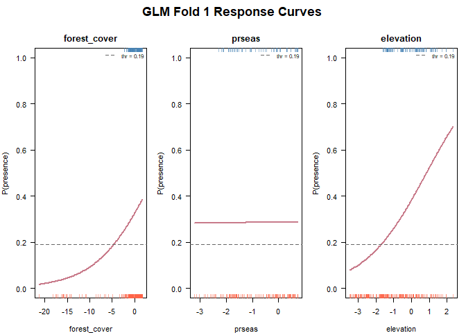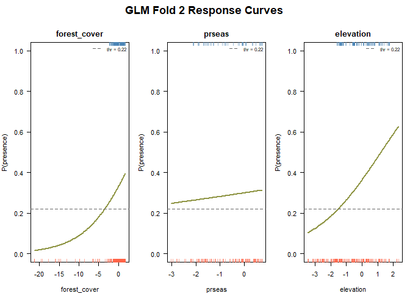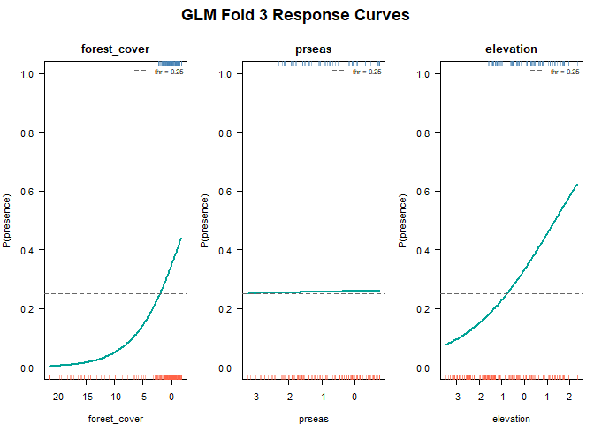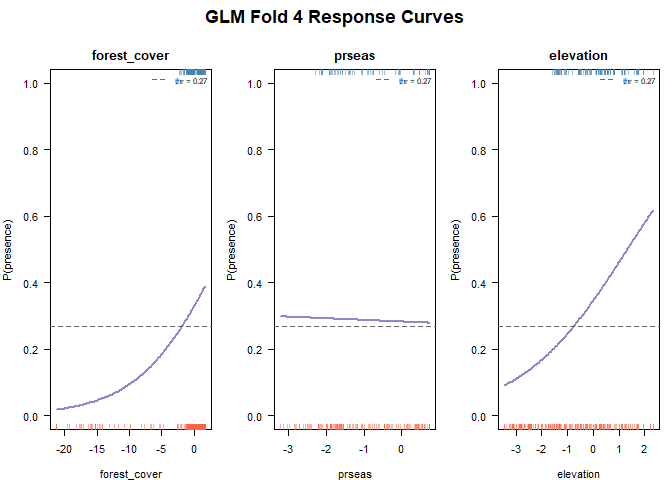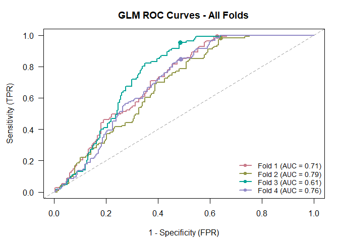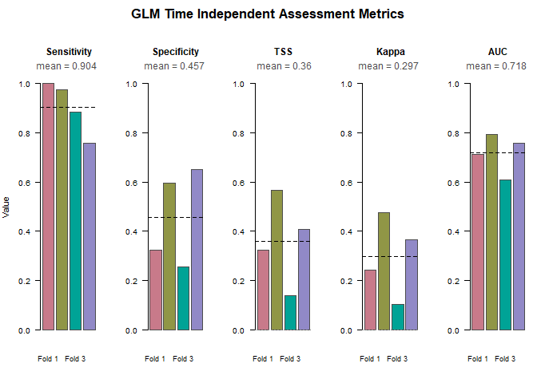

#### Step 8: Generate Predictions

We project predictions across all 15 years for the Spring season only.
The bundled `tmr_predictions` object is the output of running this on
the synthetic data:

``` r
scl_dir <- system.file("extdata/rasters_scaled", package = "TemporalModelR")

time_steps <- expand.grid(
  year             = 1:15,
  season           = "Spring",
  stringsAsFactors = FALSE
)

generate_spatiotemporal_predictions(
  partition_result     = tmr_partition,
  model_result         = tmr_glm,
  pseudoabsence_result = tmr_absences,
  raster_dir           = scl_dir,
  variable_patterns    = my_variable_patterns,
  time_cols            = c("year", "season"),
  time_steps           = time_steps,
  output_dir           = tempdir(),
  overwrite            = TRUE
)
```

Inspect a few of the bundled prediction surfaces:

``` r
pred_dir   <- system.file("extdata/predictions", package = "TemporalModelR")
pred_files <- list.files(pred_dir, pattern = "\\.tif$", full.names = TRUE)
pred_files <- pred_files[c(1, 8, 15)]

plot(rast(pred_files),
     main = c("Year 1 (Spring)", "Year 8 (Spring)", "Year 15 (Spring)"))
```

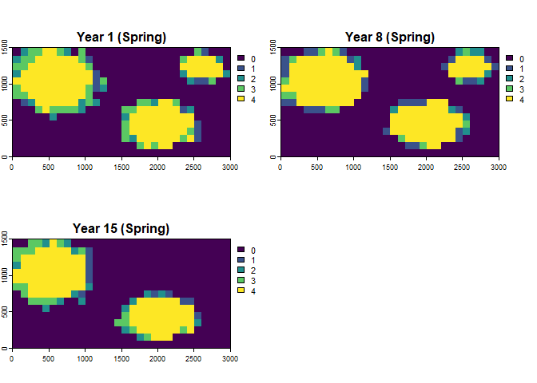

#### Step 9: Assess Model Performance

``` r
data(tmr_predictions, package = "TemporalModelR")

plot_model_assessment(
  predictions         = tmr_predictions,
  time_column         = c("year", "season"),
  secondary_time_mode = "combine",
  verbose             = FALSE
)
```

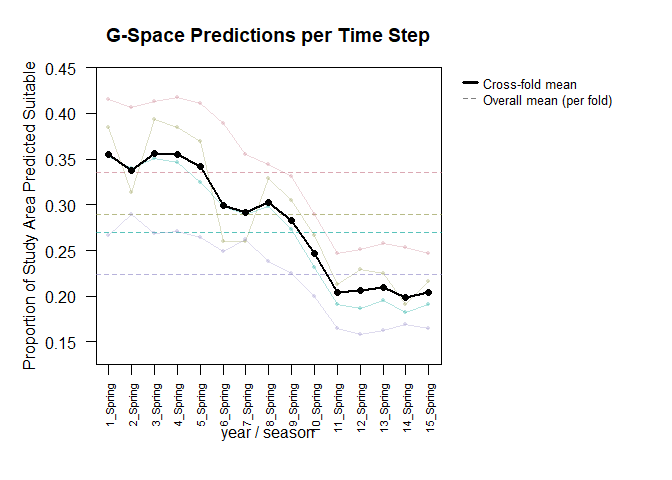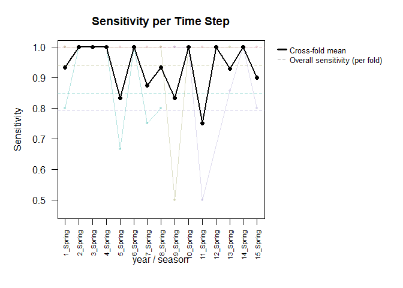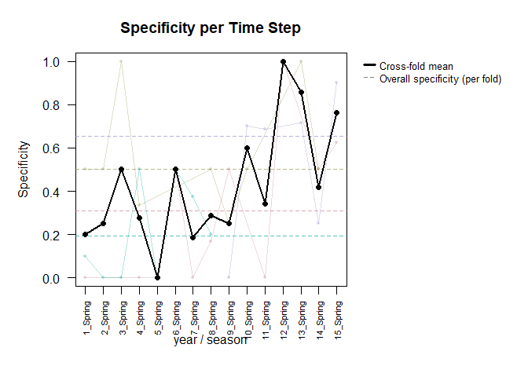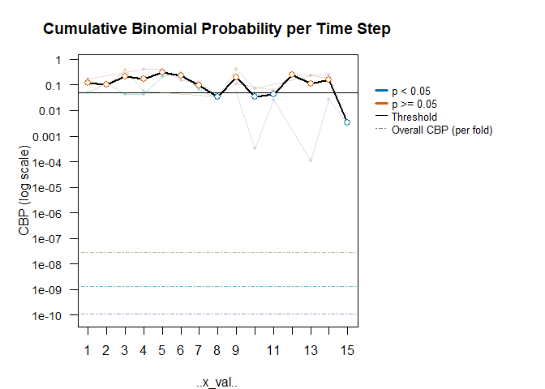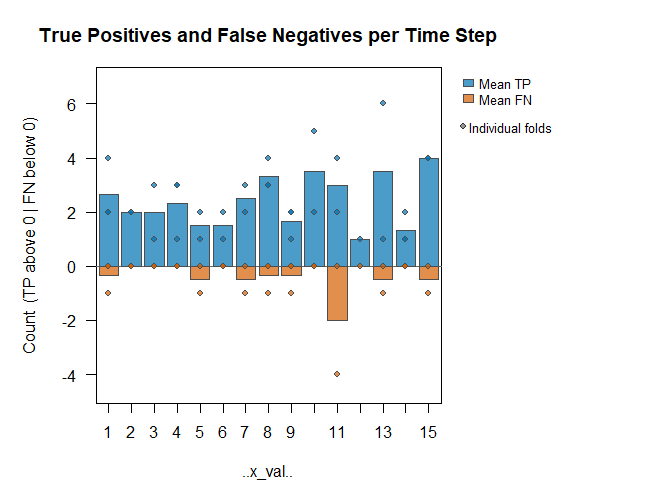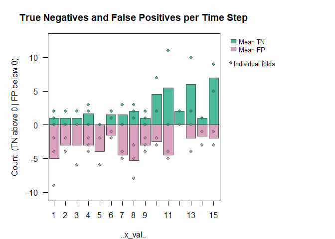

### Phase 3: Postprocessing

#### Step 10: Create Consensus Predictions

Summarise the per-fold predictions into a consensus stack (binary
suitability where at least 3 of 4 folds agree) and a frequency raster
(proportion of timesteps each pixel was suitable):

``` r
pred_dir <- system.file("extdata/predictions", package = "TemporalModelR")

binary_results <- summarize_raster_outputs(
  predictions_dir = pred_dir,
  output_dir      = tempdir(),
  consensus       = 3,
  overwrite       = TRUE,
  verbose         = FALSE
)

plot(binary_results$consensus_stack,
     main = paste("Year", 1:nlyr(binary_results$consensus_stack)))
```

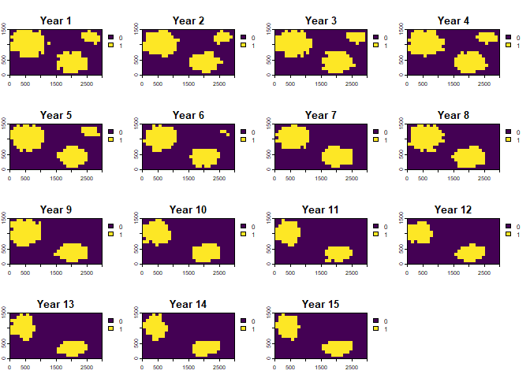

``` r
plot(binary_results$frequency_raster,
     main = "Proportion of years suitable")
```

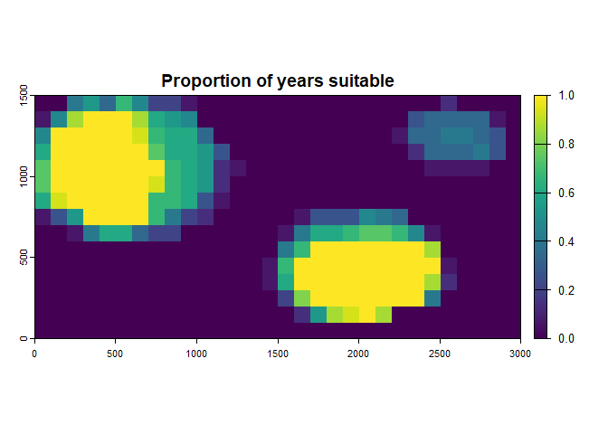

#### Step 11: Identify Temporal Patterns

Classify each pixel’s trajectory across time using changepoint
detection. The synthetic dataset has 15 timesteps, which is the
practical minimum for stable changepoint estimation:

``` r
analyze_temporal_patterns(
  binary_stack            = binary_results$consensus_stack,
  summary_raster          = binary_results$frequency_raster,
  time_steps              = 1:15,
  fastcpd_params          = list(method = "BIC"),
  output_dir              = tempdir(),
  spatial_autocorrelation = TRUE,
  verbose                 = FALSE,
  overwrite               = TRUE
)
```

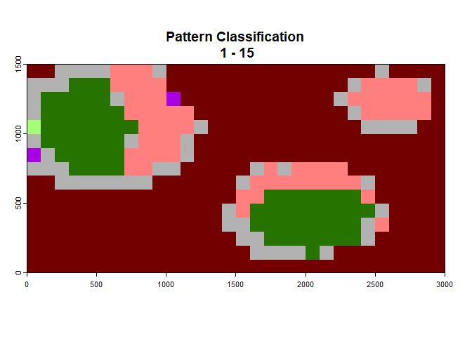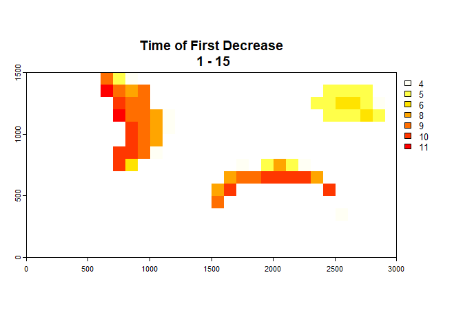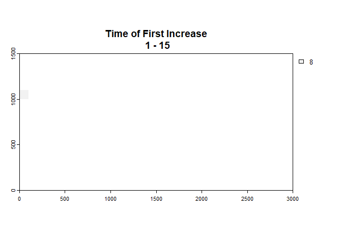

#### Step 12: Summarise by Spatial Unit

Split the study area into two zones (west and east at x = 1500 m) and
summarise habitat trends by zone:

``` r
study_crs <- st_crs(binary_results$consensus_stack)

zones_sf <- rbind(
  st_sf(ZONE = "West",
        geometry = st_sfc(st_polygon(list(
          matrix(c(0, 0, 1500, 1500, 0,
                   0, 1500, 1500, 0, 0), ncol = 2)
        )), crs = study_crs)),
  st_sf(ZONE = "East",
        geometry = st_sfc(st_polygon(list(
          matrix(c(1500, 1500, 3000, 3000, 1500,
                   0,    1500, 1500, 0,    0),    ncol = 2)
        )), crs = study_crs))
)

time_steps <- expand.grid(
  year             = 1:15,
  season           = "Spring",
  stringsAsFactors = FALSE
)

analyze_trends_by_spatial_unit(
  shapefile_path = zones_sf,
  name_field     = "ZONE",
  binary_stack   = binary_results$consensus_stack,
  time_steps     = time_steps,
  pie_scale      = 0.15,
  create_plot    = TRUE,
  verbose        = FALSE
)
#>   |                                                          |                                                  |   0%  |                                                          |===                                               |   7%  |                                                          |=======                                           |  13%  |                                                          |==========                                        |  20%  |                                                          |=============                                     |  27%  |                                                          |=================                                 |  33%  |                                                          |====================                              |  40%  |                                                          |=======================                           |  47%  |                                                          |===========================                       |  53%  |                                                          |==============================                    |  60%  |                                                          |=================================                 |  67%  |                                                          |=====================================             |  73%  |                                                          |========================================          |  80%  |                                                          |===========================================       |  87%  |                                                          |===============================================   |  93%  |                                                          |==================================================| 100%
```

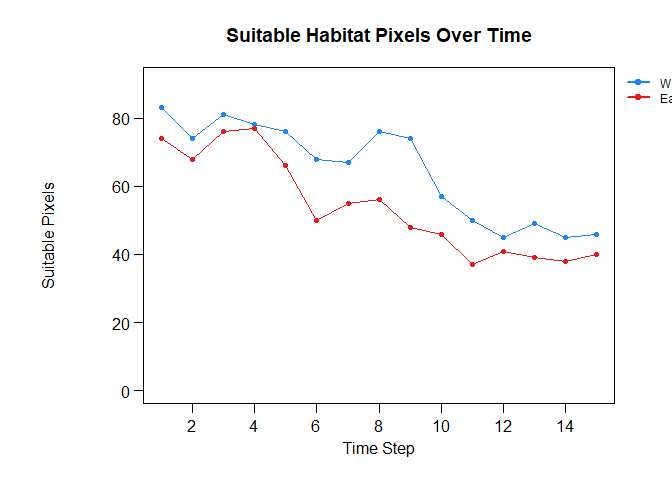

## Citation

If you use TemporalModelR in your research, please cite:

Hughes, C., Castaneda-Guzman, M., & Escobar, L.E. (2026).
TemporalModelR: A tool for temporally explicit species distribution
modeling. \[Journal information to be added\]

## Getting Help

- Report bugs or request features: [GitHub
  Issues](https://github.com/CJHughes926/TemporalModelR/issues)
- Ask questions: [GitHub
  Discussions](https://github.com/CJHughes926/TemporalModelR/discussions)

## License

MIT + file LICENSE

## Acknowledgments

TemporalModelR builds on several excellent packages:

- [hypervolume](https://cran.r-project.org/package=hypervolume) for
  niche modeling
- [mgcv](https://cran.r-project.org/package=mgcv) for GAMs
- [randomForest](https://cran.r-project.org/package=randomForest) for
  random forest models
- [fastcpd](https://cran.r-project.org/package=fastcpd) for changepoint
  detection
- [terra](https://cran.r-project.org/package=terra) and
  [sf](https://cran.r-project.org/package=sf) for spatial data handling
