# TemporalModelR

TemporalModelR is an R package for building temporally explicit species
distribution models. The package provides a complete workflow including
generalized data pre- and post-processing, hypervolume-based temporally
explicit model construction, and temporal pattern analysis.

## Overview

TemporalModelR functions support researchers ability to:

- Preprocess spatial and temporal occurrence data with spatiotemporal
  rarefication
- Extract temporally aligned environmental variables to temporal
  occurrence records
- Build hypervolume models using Gaussian kernel density or one-class
  SVM methods
- Generate spatiotemporal predictions with comprehensive model
  evaluation metrics across variable time scales
- Analyze temporal patterns in habitat suitability using changepoint
  detection
- Summarize trends by spatial units for regional conservation
  assessments

## Installation

You can install the most updated version of TemporalModelR from GitHub:

``` r
# install.packages("pak")
pak::pak("CJHughes926/TemporalModelR")
```

## Workflow Overview

The TemporalModelR workflow consists of three main phases:

### Phase 1: Preprocessing

| Function | Description |
|----|----|
| `raster_align()` | Aligns environmental rasters to a common projection, extent, and resolution |
| `spatiotemporal_rarefication()` | Rarefies occurrence data to reduce spatial and temporal bias |
| `temporally_explicit_extraction()` | Extracts environmental values at occurrence locations matched to time of observation |
| `scale_rasters()` | Standardizes environmental rasters using scaling parameters from occurrence data |
| `spatiotemporal_partition()` | Partitions occurrences into spatially and temporally independent cross-validation folds |

### Phase 2: Modeling

| Function | Description |
|----|----|
| `build_hypervolume_models()` | Constructs Gaussian or SVM hypervolume models for each fold |
| `generate_spatiotemporal_predictions()` | Projects hypervolumes across space and time |
| `plot_model_assessment()` | Visualizes model performance metrics across time |

### Phase 3: Postprocessing

| Function | Description |
|----|----|
| `summarize_raster_outputs()` | Creates consensus binary predictions and temporal summaries |
| `analyze_temporal_patterns()` | Classifies pixels into temporal trend categories using changepoint detection |
| `analyze_trends_by_spatial_unit()` | Aggregates patterns and trends by administrative or ecological units |

## General Usage Guide

### Preprocessing Functions

#### Aligning Rasters

Before analysis, all environmental rasters must share the same
projection, extent, and resolution. The `raster_align()` function
handles this preprocessing step:

``` r
raster_align(
  input_dir = "path/to/raw_rasters/",
  output_dir = "path/to/aligned_rasters/",
  reference_raster = my_reference_raster,
  overwrite = FALSE
)
```

#### Spatiotemporal Rarefication

Traditional spatial rarefication retains one point per pixel, discarding
temporal replicates. Spatiotemporal rarefication preserves valuable
temporal information by retaining one point per pixel per time step:

``` r
spatiotemporal_rarefication(
  points_sp = "occurrences.csv",
  xcol = "longitude",
  ycol = "latitude",
  points_crs = 4326,
  output_dir = "output/",
  reference_raster = my_reference_raster,
  time_cols = c("Year")
)
```

#### Temporally Explicit Extraction

This function extracts environmental values at each occurrence location
using rasters that match the time of observation. Dynamic variables
(like land cover) are matched to specific time steps (like year, month,
or day), while static variables (like elevation) are extracted once.
Where relevant, multiple time steps can be provided for a given variable
(For example, Month and Year):

``` r
variable_patterns <- c(
  "landcover" = "landcover_YEAR",    # Dynamic: matched to occurrence year
  "temp" = "temp_MONTH_YEAR",    # Dynamic: matched to occurrence both month and year
  "elevation" = "elevation"           # Static: extracted once
)

temporally_explicit_extraction(
  points_sp = "rarefied_points.csv",
  xcol = "X",
  ycol = "Y",
  points_crs = 4326,
  raster_dir = "aligned_rasters/",
  variable_patterns = variable_patterns,
  time_cols = c("Year", "Month"),
  output_dir = "output/",
  output_prefix = "extracted_data"
)
```

#### Scale Environmental Rasters

Standardize all environmental rasters using the scaling parameters
calculated from your occurrence data. This ensures that all raster
values are on equivalent scales as they relate to your occurrence data,
and prevents uneven contribution across variables to models:

``` r
scale_rasters(
  input_dir = "aligned_rasters/",
  output_dir = "scaled_rasters/",
  scaling_params_file = "./output/extracted_data_Scaling_Parameters.csv",
  variable_patterns = variable_patterns,
  time_cols = c("Year", "Month"),
  overwrite = T
)
```

#### Spatiotemporal Partitioning

Creates cross-validation folds that are spatially and/or temporally
independent. This ensures that model evaluation reflects true predictive
performance rather than spatial or temporal autocorrelation:

``` r
partition_results <- spatiotemporal_partition(
  reference_shapefile_path = study_area_sf,
  points_file_path = "./output/extracted_data_Scaled_Values.csv",
  time_col = "Year",
  xcol = "x",
  ycol = "y",
  points_crs = 4326,
  n_spatial_folds = 2,
  n_temporal_folds = 2,
  max_imbalance = 0.05,
  generate_plots = TRUE,
  output_file = "partition_results.rds"
)
```

### Modeling Functions

#### Building Hypervolume Models

Hypervolume models define the environmental niche as an n-dimensional
volume in environmental space. The package supports both Gaussian kernel
density estimation and one-class SVM methods:

``` r
hv_results <- build_hypervolume_models(
  partition_results = "partition_results.rds",
  model_vars = c("var1", "var2", "var3"),
  method = "gaussian",
  output_dir = "hypervolumes/",
  hypervolume_params = list(
    quantile.requested = 0.95,
    quantile.requested.type = "probability"
  ),
  create_plot = TRUE,
  overwrite = FALSE
)
```

#### Generating Predictions

Projects the hypervolume models onto geographic space for each time
step, producing both continuous suitability surfaces and model
assessment metrics. Supports generation across time step combinations
(like Month and Year), but assumes variable patterns missing time steps
are static across those time steps. For example, with these variable
patterns

variable_patterns \<- c( “landcover” = “landcover_YEAR”, “temp” =
“temp_MONTH_YEAR”, “elevation” = “elevation” )

Elevation is assumed to be static across all time steps (months and
years), land cover is assumed to only vary across years, but remains
static across all months within a given year, and temp is assumed to
vary dynamically across month/year combinations.

``` r
time_steps <- expand.grid(Year = 1990:2020, Month = 1:12)

predictions <- generate_spatiotemporal_predictions(
  partition_results = "partition_results.rds",
  hypervolume_results = "hypervolumes/all_hypervolumes_gaussian.rds",
  time_cols = c("Year", "Month"),
  time_steps = time_steps,
  variable_patterns = variable_patterns,
  raster_dir = "scaled_rasters/",
  output_dir = "predictions/",
  overwrite = FALSE
)
```

### Postprocessing Functions

#### Summarizing Predictions

Creates consensus predictions (where all folds agree) and calculates
proportion of years where each pixel is returned as suitable, ‘pixel
stability’:

``` r
summary_results <- summarize_raster_outputs(
  predictions_dir = "predictions/",
  output_dir = "summaries/",
  overwrite = TRUE
)
```

#### Analyzing Temporal Patterns

Uses changepoint detection to classify each pixel’s temporal trajectory
into categories: never suitable, always suitable, stable, increasing,
decreasing, or fluctuating.

Assumes values change consecutively (supports annual or decadal changes
that are expected to have linear change, but should not be used with
cyclical changes like monthy predictions, unless analyzing one month
across years) AND will fail if time series is not long enough to detect
substantial changes over time (usually ~15 time steps minimum).

For large data sets this function may take a long time.

``` r
pattern_results <- analyze_temporal_patterns(
  binary_stack = summary_results$binary_stack,
  summary_raster = summary_results$summary_raster,
  time_steps = 1990:2020,
  fastcpd_params = list(method = "BIC"),
  output_dir = "temporal_patterns/",
  spatial_autocorrelation = TRUE,
  show_progress = TRUE,
  overwrite = TRUE
)
```

#### Summarizing by Spatial Units

Aggregates temporal patterns and trends across relevant administrative
or ecological boundaries (States, Watersheds, Countries, etc.):

``` r
spatial_results <- analyze_trends_by_spatial_unit(
  shapefile_path = admin_boundaries,
  name_field = "NAME",
  binary_stack = summary_results$binary_stack,
  pattern_raster = "temporal_patterns/pattern_raster.tif",
  year_decrease_raster = "temporal_patterns/year_first_decrease.tif",
  year_increase_raster = "temporal_patterns/year_first_increase.tif",
  output_dir = "spatial_analysis/",
  time_steps = 1990:2020,
  pie_scale = 0.5
)
```

## Example: Eastern Meadowlark Habitat Analysis

This example demonstrates the complete TemporalModelR workflow using
Eastern Meadowlark (*Sturnella magna*) occurrence data from the DC Metro
region (1995-2022) and is a simplified version of the analysis avalable
in Hughes et al. 2026 (in prep). Data to run this analysis is available
in the supplementary material of that publication.

### Setup

``` r
library(TemporalModelR)
library(terra)
library(sf)
library(raster)
```

### Prepare Study Area

For this analysis, we focus on Loudoun County, VA and Montgomery County,
MD, areas that have experienced substantial land use change in recent
decades.

``` r
my_reference_raster <- "./reverse_water_mask_DCMetro.tif"
counties_path <- "./Shapefiles/DCMetro_Counties.shp"

r <- raster(my_reference_raster)
counties <- st_read(counties_path)

loudoun <- counties[counties$NAMELSAD %in% c("Loudoun County", "Montgomery County"), ]
loudoun <- st_transform(loudoun, crs(r))

r_loudoun <- crop(r, loudoun)
r_loudoun <- mask(r_loudoun, loudoun)

### Aggregate to coarser resolution for faster processing in this example
r_loudoun_agg <- aggregate(r_loudoun, fact = 9, fun = mean, na.rm = TRUE)
plot(r_loudoun_agg)
```

We generate a reference raster of the study area at a course resolution
for use in this example.

Study area: Loudoun County, VA and Montgomery County, MD

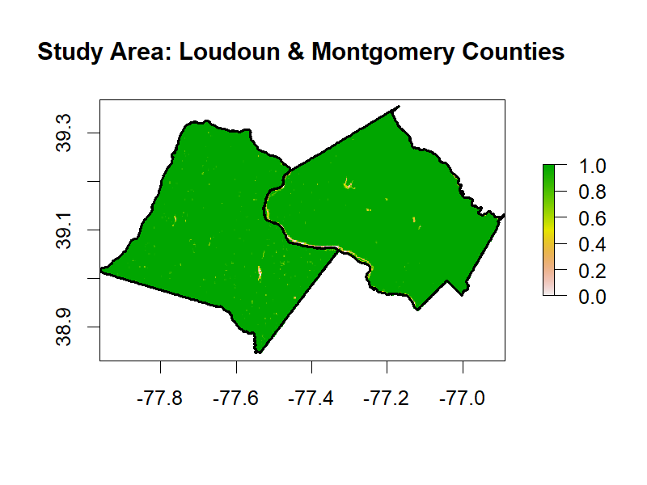

### Phase 1: Preprocessing

#### Step 1: Align Environmental Rasters

Make sure all raters are aligned and at the relevant scale of our study
area.

``` r
raster_align(
  input_dir = "./Loudoun_Montgomery_Rasters_RAW/",
  output_dir = "./Masked_Projected_Variables/",
  reference_raster = r_loudoun_agg,
  overwrite = FALSE
)
```

#### Step 2: Rarefy Occurrence Data

Rarefying our occurance data by space and time retains more points than
just space alone.

``` r
spatiotemporal_rarefication(
  points_sp = "./Pointfiles/simple_occupied_DC_Metro_AOU_5010.csv",
  xcol = "LONGDD",
  ycol = "LATDD",
  points_crs = 4326,
  output_dir = "./Pointfiles/",
  reference_raster = r_loudoun_agg,
  time_cols = c("Year")
)
```

#### Step 3: Extract Environmental Values

We use three land cover variables as simple proxies for meadowlark
habitat requirements: developed land, open land, and forest cover.

``` r
my_variable_patterns <- c(
  "Developed_Percentage" = "Developed_Percentage_YEAR",
  "Open_Percentage" = "Open_Percentage_YEAR",
  "Forest_Percentage" = "Forest_Percentage_YEAR"
)

temporally_explicit_extraction(
  points_sp = "./Pointfiles/Pts_Database_OnePerPixPerTimeStep.csv",
  xcol = "X",
  ycol = "Y",
  points_crs = 4326,  
  raster_dir = "./Masked_Projected_Variables/",
  variable_patterns = my_variable_patterns,
  time_cols = "Year",
  output_dir = "./Pointfiles/",
  output_prefix = "temp_explicit_df"
)
```

#### Step 4: Scale Rasters

Scale all environmental rasters to ensure potential variable
contribution is even across each environmental variable

``` r
scale_rasters(
  input_dir = "./Masked_Projected_Variables/",
  output_dir = "./Scaled_Variables/",
  scaling_params_file = "./Pointfiles/temp_explicit_df_Scaling_Parameters.csv",
  variable_patterns = my_variable_patterns,
  time_cols = c("Year"),
  overwrite = FALSE
)
```

#### Step 5: Partition Data

We create four folds: two spatially explicit and two temporally
explicit. This ensures our model evaluation accounts for both spatial
and temporal structure in the data.

``` r
spatiotemporal_partition(
  reference_shapefile_path = st_geometry(loudoun),
  points_file_path = "./Pointfiles/temp_explicit_df_Scaled_Values.csv",
  time_col = "Year",
  xcol = "x",
  ycol = "y",
  points_crs = 4326,
  n_spatial_folds = 2,
  n_temporal_folds = 2,
  max_imbalance = 0.025,
  generate_plots = TRUE,
  output_file = "./Pointfiles/partitioning_results_spatial.rds"
)
```

Spatiotemporal partitioning showing fold distribution across space and
time. Points are colored by fold assignment, with shapes indicating
temporal blocks. Here, folds 1 and 2 are spatially explicit folds, not
overlapping with each other in space, and folds 3 and 4 are temporally
explicit folds, not overlapping with eachother in time.

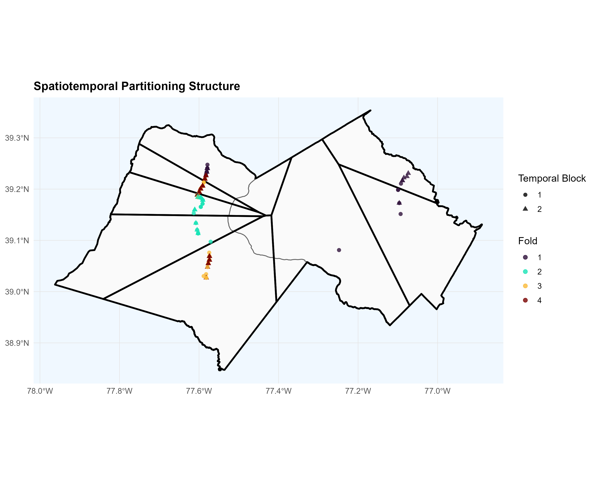

### Phase 2: Modeling

#### Step 6: Build Hypervolume Models

``` r
build_hypervolume_models(
  partition_results = "./Pointfiles/partitioning_results_spatial.rds",
  model_vars = c("Developed_Percentage", "Open_Percentage", "Forest_Percentage"),
  method = "gaussian",
  output_dir = "./Results/Hypervolume_Gaussian_simple/",
  hypervolume_params = list(
    quantile.requested = 0.95,
    quantile.requested.type = "probability"
  ),
  create_plot = TRUE,
  overwrite = TRUE
)
```

Hypervolume comparison across cross-validation folds. High overlap
between folds indicates consistent niche estimation across training sets

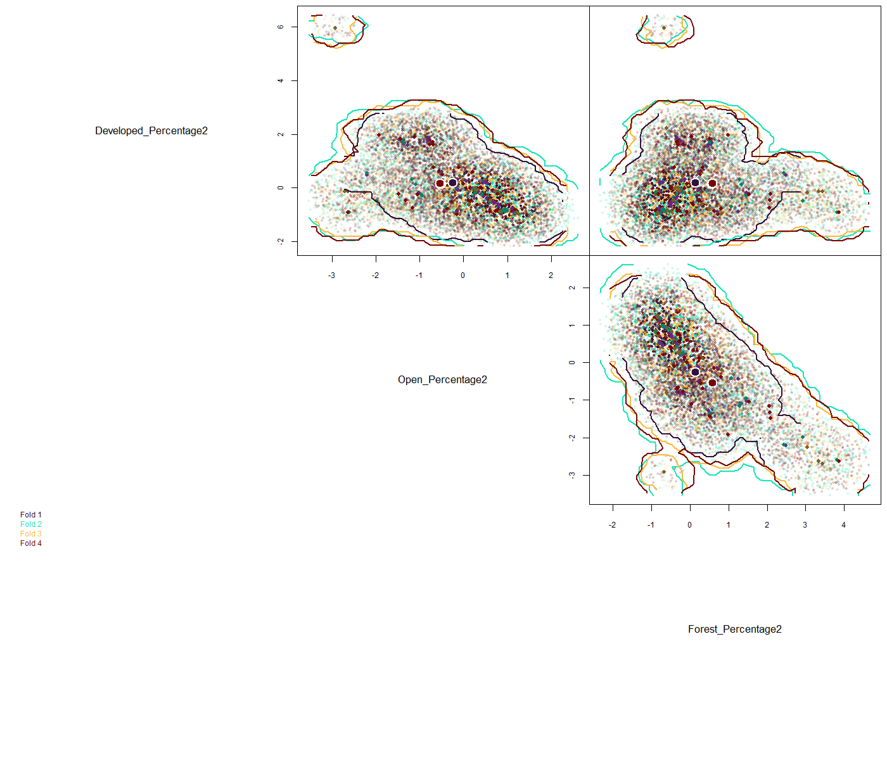

#### Step 7: Generate Predictions

``` r
my_variable_patterns <- c(
  "Developed_Percentage" = "Developed_Percentage_YEAR",
  "Open_Percentage" = "Open_Percentage_YEAR",
  "Forest_Percentage" = "Forest_Percentage_YEAR"
)

time_steps <- 1995:2022

generate_spatiotemporal_predictions(
  partition_results = "./Pointfiles/partitioning_results_spatial.rds",
  hypervolume_results = "./Results/Hypervolume_Gaussian_simple/all_hypervolumes_gaussian.rds",
  time_col = "Year",
  time_steps = time_steps,
  variable_patterns = my_variable_patterns,
  raster_dir = "./Scaled_Variables/",
  output_dir = "./Results/Prediction_Rasters/",
  overwrite = FALSE
)
```

#### Step 8: Assess Model Performance

We assess model robustness both in G-space and E-space

``` r
plot_model_assessment(
  data_file_path = "./Results/Prediction_Rasters/Model_Assessment_Metrics.csv",
  time_column = "Year",
  separate_cbp = TRUE,
  cbp_threshold = 0.05
)
```

Hypervolume size and sensitivity metrics over time. Dual y-axes show
both the proportion of study area predicted as suitable and model
sensitivity in G- and E-space.

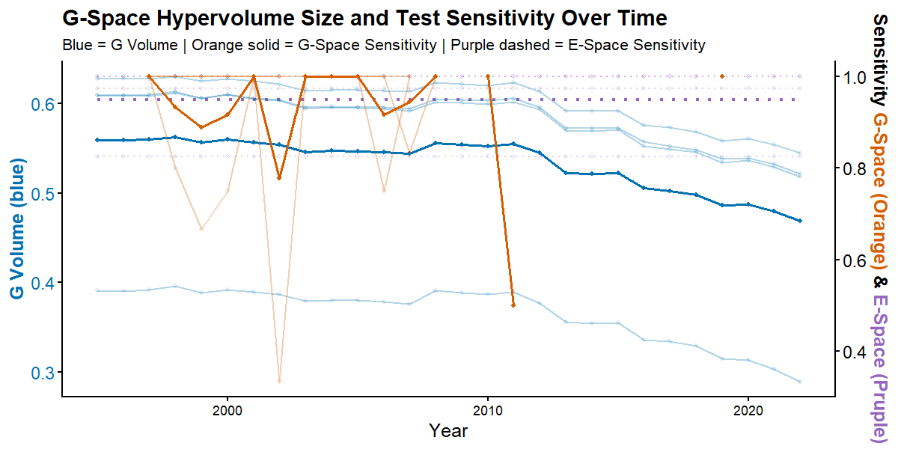

Cumulative Binomial Probability in Geographic Space. Values below the
threshold (dashed line) indicate model predictions significantly better
than random. Beacuse this example works with a small subset of our data,
its predictive preformance is not better than random most years when
assessed with time-spesific metrics in g-space.

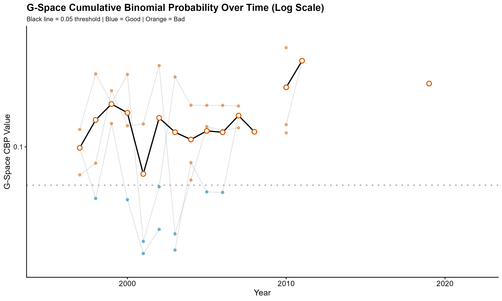

Cumulative Binomial Probability in Environmental Space. E-space
assessment provides time-independent model evaluation. When evaluating
with time independent metrics, the model results are better than random
across all years.

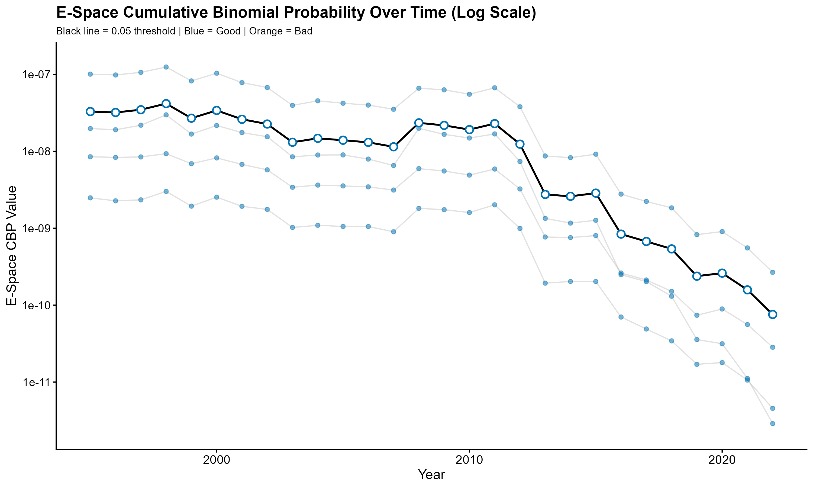

In this example, we’lll assume these metrics are satisfactory to move
onto post processing, but we could also run additional models until one
preforms satisfactorily for the purposes of our study.

### Phase 3: Postprocessing

#### Step 9: Create Consensus Predictions

Summarize where all folds of our model agree on suitability

``` r
Binary_Results <- summarize_raster_outputs(
  predictions_dir = "./Results/Prediction_Rasters/",
  output_dir = "./Results/Binary_Summaries_simple/",
  overwrite = TRUE
)

plot(Binary_Results$binary_stack)
```

Here we see annual predictive rasters generated above:

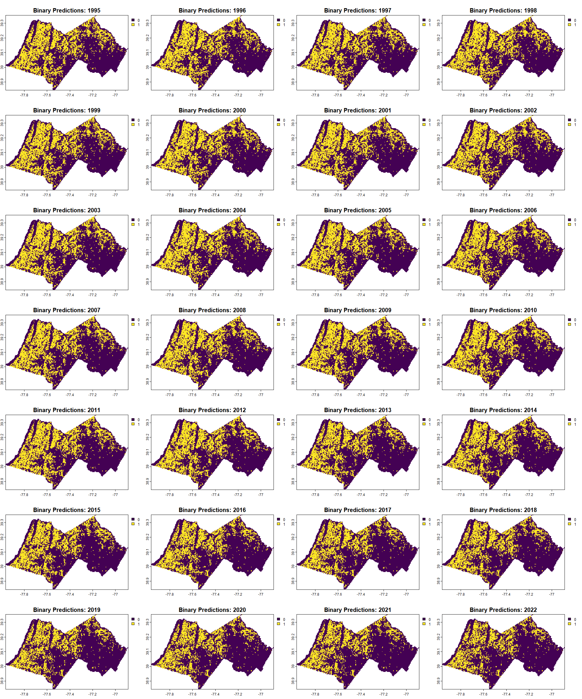

Along with an assessment of stability across time. The resulting figure
shows the proportion of years each pixel was predicted as suitable
habitat (1995-2022). Darker colors indicate more consistently suitable
areas.

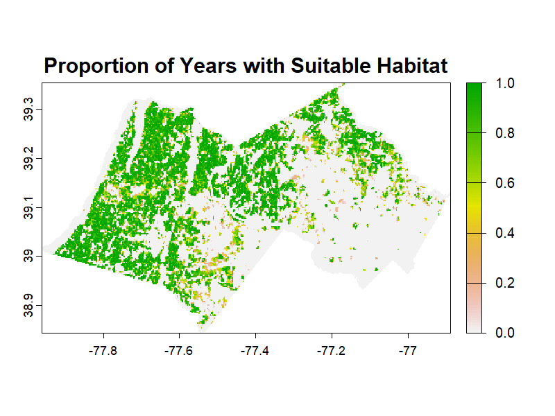

#### Step 10: Identify Temporal Patterns

Assess the tragectory of each pixels predictions across time to classify
pixels as stable suitable, stable unsuitable, increasing or decreasing
in suitability, or noisy.

``` r
time_steps <- 1995:2022

results <- analyze_temporal_patterns(
  binary_stack = Binary_Results$binary_stack,
  summary_raster = Binary_Results$summary_raster,
  time_steps = time_steps,
  fastcpd_params = list(method = "BIC"),
  output_dir = "./Results/Patterns/",
  spatial_autocorrelation = TRUE,
  show_progress = TRUE,
  estimate_time = TRUE,
  overwrite = TRUE
)
```

Temporal pattern classification showing habitat trends.

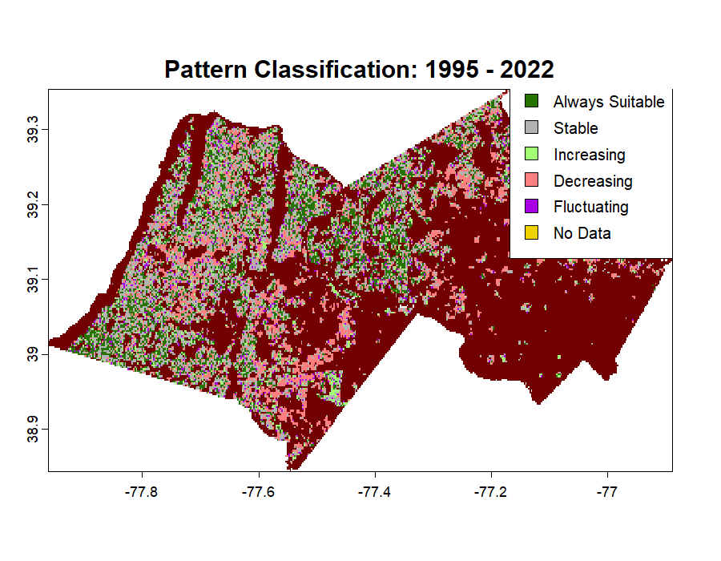

#### Step 11: Summarize by County

Asses coarser scale patterns of habitat suitbaility across time and
stability. This tool gives us more general summary of where and when
habitat is most abundant, and where and when losses or gains occur.

``` r
counties_sf <- sf::st_as_sf(loudoun)

analyze_trends_by_spatial_unit(
  shapefile_path = counties_sf,
  name_field = "NAMELSAD",
  binary_stack = Binary_Results$binary_stack,
  pattern_raster = "./Results/Patterns/pattern_raster_1995_2022.tif",
  year_decrease_raster = "./Results/Patterns/year_first_decrease_1995_2022.tif",
  year_increase_raster = "./Results/Patterns/year_first_increase_1995_2022.tif",
  output_dir = "./Results/Spatial_Unit_Analysis/",
  time_steps = time_steps,
  pie_scale = 0.45
)
```

We see Loudoun county has a higher proportion of area that is suitable
during at least one time step, but also has a higher proportion of
pixels declining in suitability compared to Montgomery county.

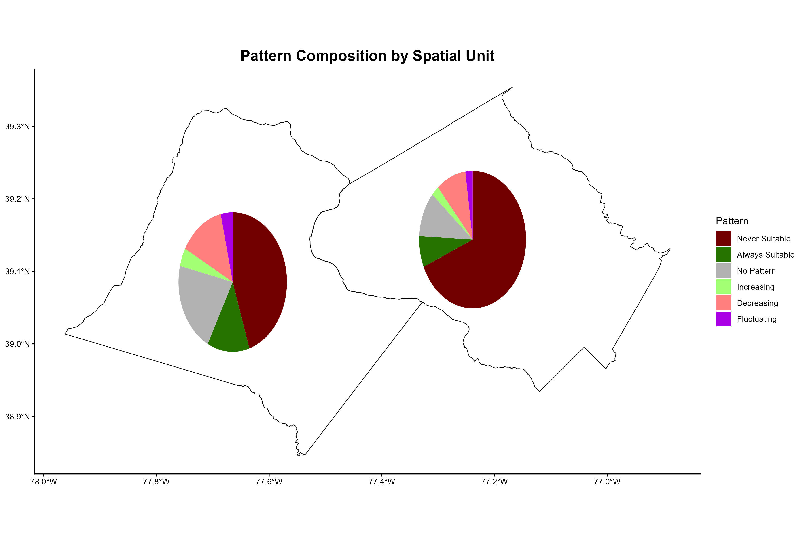

Visualizing both counties available habitat across time shows declines
in both counties.

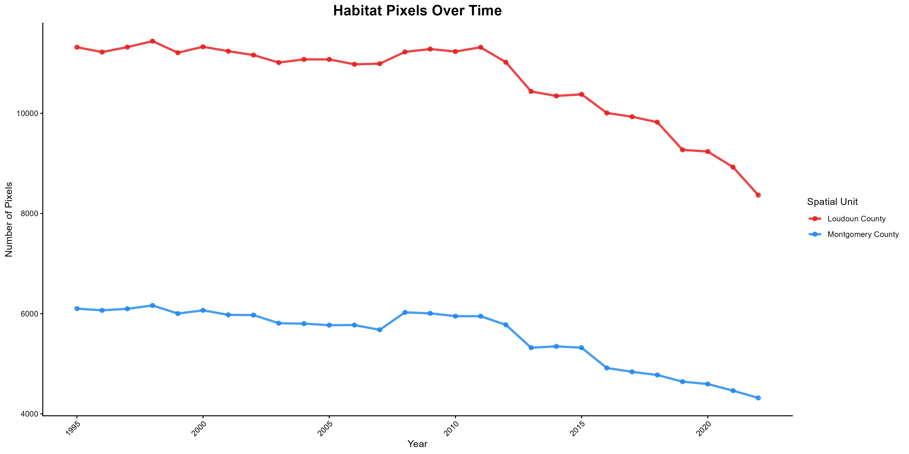

Another visualization pinpoints exactly where and when declines and
inclines in suitability occur, showing that in both counties the largest
annual declines occur primarily in the 2010’s.

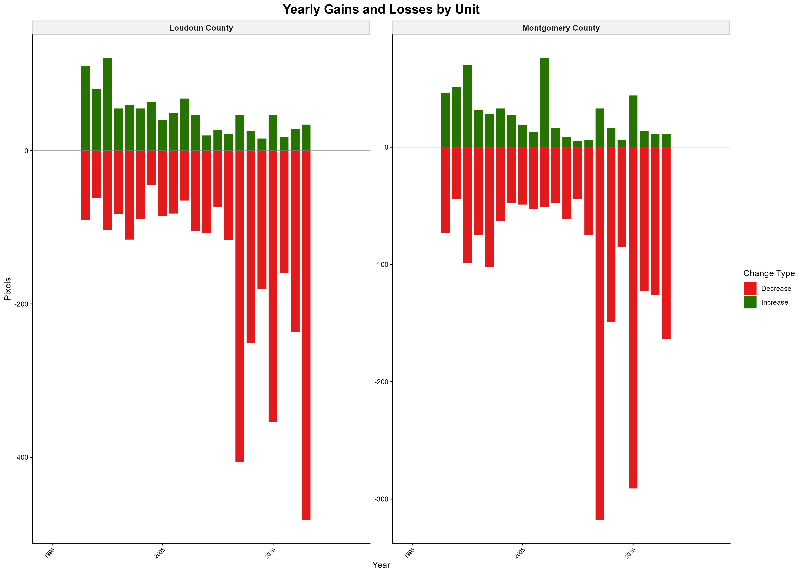

## Citation

If you use TemporalModelR in your research, please cite:

Hughes, C., Castaneda-Guzman, M., & Escobar, L.E. (2025).
TemporalModelR: A tool for temporally explicit species distribution
modeling. \[Journal information to be added\]

## Getting Help

- Report bugs or request features: [GitHub
  Issues](https://github.com/CJHughes926/TemporalModelR/issues)
- Ask questions: [GitHub
  Discussions](https://github.com/CJHughes926/TemporalModelR/discussions)

## License

\[License information to be added\]

## Acknowledgments

TemporalModelR builds on several excellent packages:

- [hypervolume](https://cran.r-project.org/package=hypervolume) for
  niche modeling
- [fastcpd](https://cran.r-project.org/package=fastcpd) for changepoint
  detection
