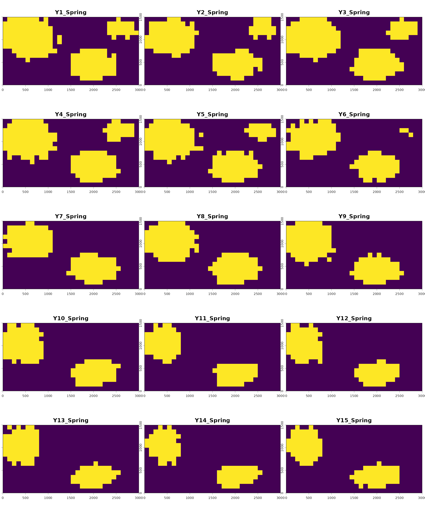
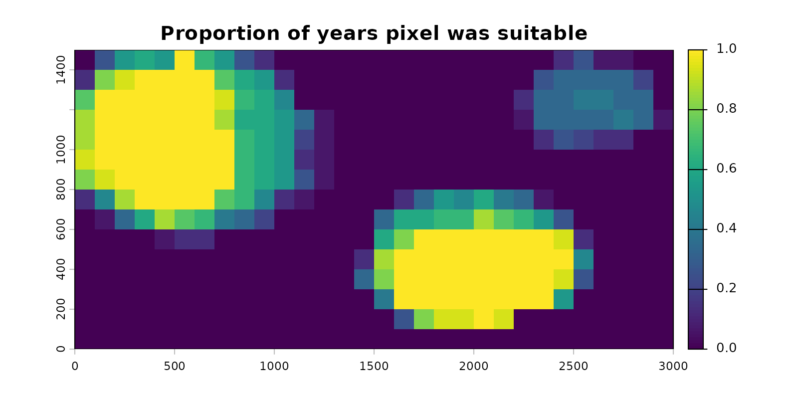
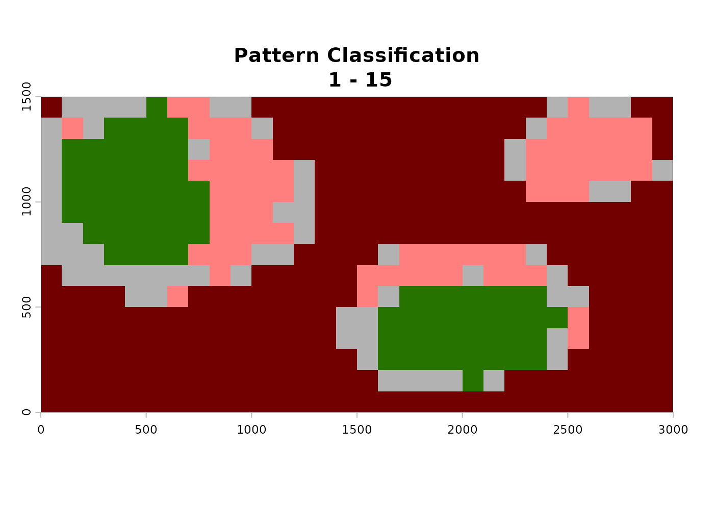
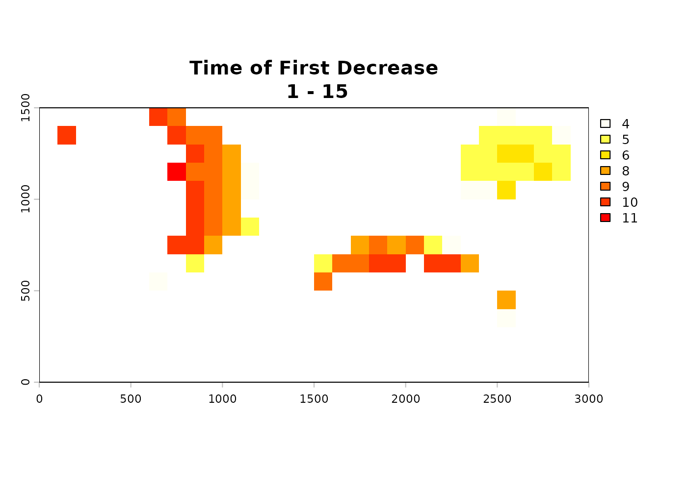
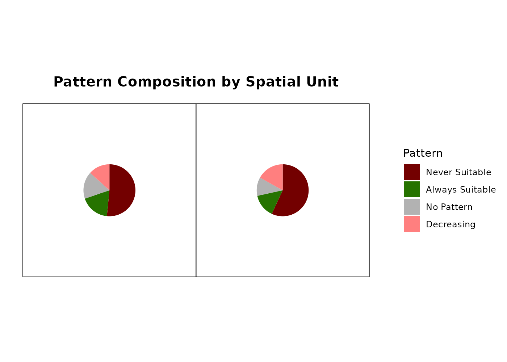
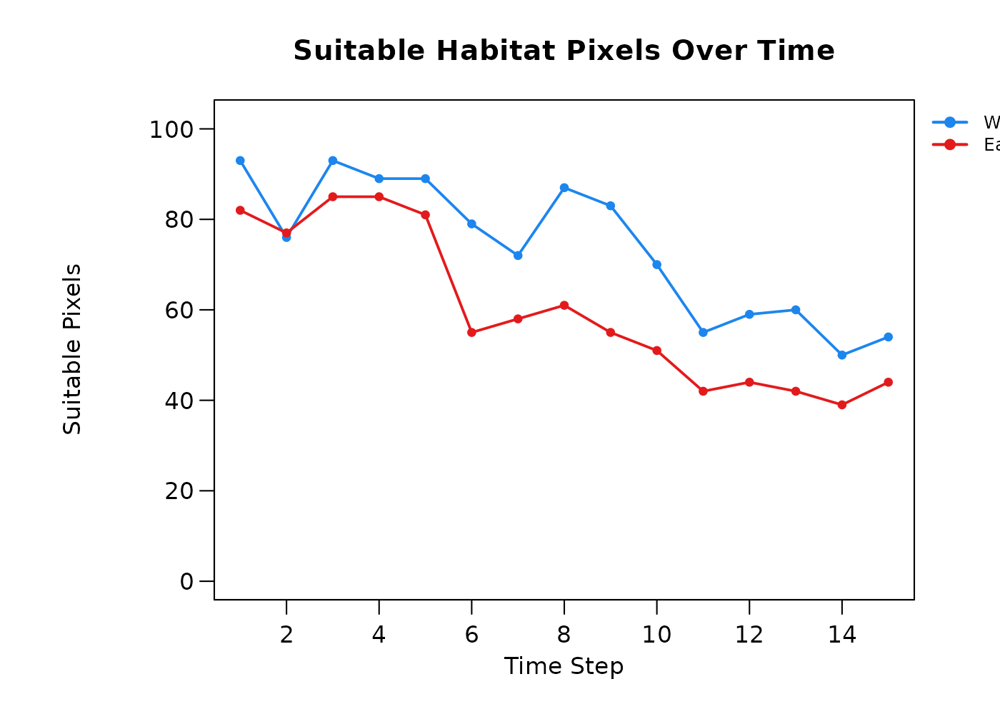
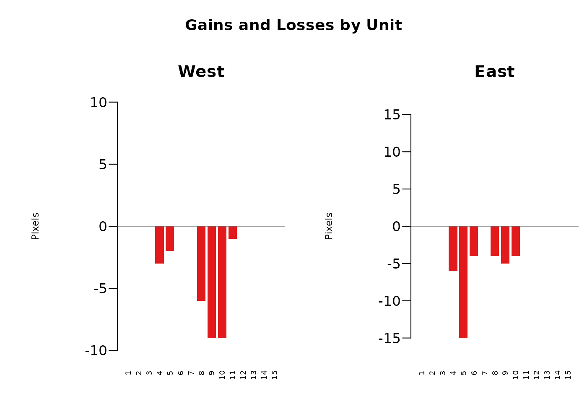

# 4. Postprocessing predictions

------------------------------------------------------------------------

## Summary

- [Overview](#sec-overview)
- [Consensus and frequency summarisation](#sec-consensus)
- [Detecting temporal patterns](#sec-patterns)
- [Aggregating by spatial unit](#sec-zones)
- [Summary](#sec-next)

------------------------------------------------------------------------

## Overview

The modeling phase described in the previous four vignettes each
produces per-fold consensus prediction rasters across time steps. These
are useful, but will often result in stacks of individual predictions
(10s to sometimes 100s of rasters) that may be difficult to make
straightforward sense of. The goal of the postprocessing phase is to
take this abundance of data and summarize it in interpretable ways,
mainly focused on understanding the overarching temporal dynamics of
each pixel, and summarizing these change patterns regionally for
intuitive analyses.

Three functions cover this phase, run in order:

1.  [`summarize_raster_outputs()`](../reference/summarize_raster_outputs.md) -
    summarizes fold-vote rasters output from
    [`generate_spatiotemporal_predictions()`](../reference/generate_spatiotemporal_predictions.md)
    into a binary consensus stack (one binary raster per time step) and
    a frequency raster (the percent of time steps where the binary
    results indicate suitability). This is important because all
    subsequent processes require binary rasters as their inputs.
2.  [`analyze_temporal_patterns()`](../reference/analyze_temporal_patterns.md) -
    classifies each pixel’s trajectory through time via changepoint
    detection, resulting in a single raster classifying each pixel as
    either ‘stable suitable’, ‘stable unsuitable’, ‘increasing in
    suitability’, ‘decreasing in suitability’, ‘fluctuating’, or ‘no
    pattern’. It also produces a ‘time of first change’ raster
    indicating when those increases or decreases occured.
3.  [`analyze_trends_by_spatial_unit()`](../reference/analyze_trends_by_spatial_unit.md) -
    aggregates pixel-level patterns across user-defined polygons. This
    takes potentially complicated rasters with many pixels and gives
    regional summaries of the spatiotemporal dynamics of each spatial
    unit.

This vignette uses the bundled `inst/extdata/predictions/` raster set,
which contains 15 per-year fold-vote rasters from the seasonal
workflow’s
[`generate_spatiotemporal_predictions()`](../reference/generate_spatiotemporal_predictions.md)
call, projecting `tmr_glm` across years 1-15 for the Spring season only.
These are the same files referenced by
`tmr_predictions$prediction_files` and are produced and inspected in the
[Modeling with a GLM](modeling_glm.md) vignette. The underlying dataset
is described in [About the Example Dataset](dataset.md).

``` r

library(TemporalModelR)
library(terra)
#> terra 1.9.27
library(sf)
#> Linking to GEOS 3.12.1, GDAL 3.8.4, PROJ 9.4.0; sf_use_s2() is TRUE

pred_dir <- system.file("extdata/predictions", package = "TemporalModelR")

list.files(pred_dir, pattern = "\\.tif$")[1:5]
#> [1] "Prediction_1_Spring.tif"  "Prediction_10_Spring.tif"
#> [3] "Prediction_11_Spring.tif" "Prediction_12_Spring.tif"
#> [5] "Prediction_13_Spring.tif"
```

Each pixel of each raster indicates the number of folds which our model
predicts that pixel as suitable in that given year. Because this was a
four fold model, possible per-pixel values range from 0 (no folds
predict this pixel as suitable) to 4 (all folds predict this pixel as
suitable).

  

## Consensus and frequency summarisation

[`summarize_raster_outputs()`](../reference/summarize_raster_outputs.md)
applies a consensus threshold to convert the fold-count rasters into
binary suitability rasters, which are needed for all postprocessing
analyses. These simplify the fold count rasters by setting a threshold
of how many folds must agree for the pixel to be considered suitable in
the postprocessing analyses. A very conservative modeling process may
want all folds to agree for a pixel to be considered suitable (in that
case, we would indicate a threshold of 4). A more relaxed modeling
process may only require half of the folds to agree for a pixel to be
considered suitable (threshold here of 2). The choice depends on the
cost of false positives versus false negatives in the given application.
Higher consensus is more conservative; lower consensus is more
sensitive. Lower consensus thresholds may also introduce additional
noise into the postprocessing results, which should be considered for
this process.

In either case, all pixels which meet or exceed the user set threshold
become a binary ‘1’ for suitable, and all others become a binary ‘0’ for
unsuitable.

A ‘frequency file’ is also produced based on the binarized rasters. This
is a single raster which indicates the proportion of time steps for
which the binary rasters agree a pixel is suitable, and is a good
indication of the temporal stability of a pixel’s predictions.

``` r

summary_out <- summarize_raster_outputs(
  predictions_dir = pred_dir,
  output_dir      = file.path(tempdir(), "Binary"),
  consensus       = 2,
  overwrite       = TRUE,
  verbose         = FALSE
)

names(summary_out)
#> [1] "consensus_stack"  "frequency_raster" "consensus"        "n_timesteps"     
#> [5] "consensus_dir"    "frequency_file"
```

The returned object contains the following items:

- `$consensus_stack` - multi-layer `SpatRaster` with one layer per input
  time step. For each layer, pixels are 1 where the threshold of folds
  in agreement set by `consensus` is met and 0 elsewhere.
- `$frequency_raster` - single-layer `SpatRaster` giving the proportion
  of time steps each pixel was suitable under the chosen consensus
  threshold. Values range from 0 (never suitable) to 1 (always
  suitable).
- `$consensus` - the consensus threshold value used.
- `$n_timesteps` - number of time steps processed (equal to the number
  of input rasters).
- `$consensus_dir` - path to the directory containing the per-time-step
  binary consensus rasters that were written to disk.
- `$frequency_file` - path to the written frequency raster file.

We can visualize the per-year consensus stack to inspect the
year-to-year breakdown of projected suitability.

``` r

binary_stack   <- summary_out$consensus_stack
frequency_rast <- summary_out$frequency_raster

names(binary_stack) <- paste0("Y", 1:15, "_Spring")

terra::plot(binary_stack, nr = 5, nc = 3,
            mar = c(1.5, 0.5, 1.5, 0.5), legend = FALSE)
```



Suitable pixels (1) appear in yellow and unsuitable pixels (0) in
purple. The reduction in suitable area starting around year 6 reflects
the deforestation trend present in the underlying forest cover rasters,
just as would be expected based on the changing landscape.

The frequency raster is a single layer summarising all 15 panels into
one:

``` r

terra::plot(frequency_rast,
            main = "Proportion of years pixel was suitable",
            mar  = c(2.5, 2.5, 2.5, 5.0))
```



Pixels of consistently suitable habitat sit close to 1, indicating they
were always predicted as suitable. Pixels that gained or lost
suitability across the time series sit between 0 and 1, indicating
suitability was inconsistent across time. Surrounding areas sit at 0,
indicating they were never suitable. The pixels with values between 0
and 1 are the ones that will carry information for the changepoint
detection in the next section.

  

## Detecting temporal patterns

[`analyze_temporal_patterns()`](../reference/analyze_temporal_patterns.md)
applies changepoint detection to each pixel’s binary suitability time
series, classifying it into one of six categories:

1.  **Never suitable** - pixel is unsuitable in every time step.
2.  **Always suitable** - pixel is suitable in every time step.
3.  **No pattern** - pixel varies through time but no significant
    structured change is detected.
4.  **Increasing suitability** - pixel transitions from unsuitable to
    suitable at a detectable change point.
5.  **Decreasing suitability** - pixel transitions from suitable to
    unsuitable at a detectable change point.
6.  **Fluctuating** - pixel shows multiple direction changes through
    time.

Changepoint detection runs via
[`fastcpd::fastcpd_binomial()`](https://fastcpd.xingchi.li/reference/fastcpd_binomial.html)
with each pixel’s previous-time-step value included as a predictor to
account for temporal autocorrelation. When
`spatial_autocorrelation = TRUE`, the proportion of a pixel’s
first-order neighbours classified as suitable in each time step is also
considered as an additional covariate to the changepoint detection
model, accounting for spatial autocorrelation in the predictive surface.

The `fastcpd` package is a hard dependency of
[`analyze_temporal_patterns()`](../reference/analyze_temporal_patterns.md)
and must be installed before running:

``` r

install.packages("fastcpd")
```

Additionally, unlike other functions in TemporalModelR which may use
cyclical or temporally nonlinear time steps (like multiple seasons
within a year where predictions are expected to fluctuate),
[`analyze_temporal_patterns()`](../reference/analyze_temporal_patterns.md)
expects a linear time series to run the analysis on. In our example, we
could have rerun all our examples at an annual scale rather than a
seasonal scale and passed that result to this analysis. Alternatively,
we may run this analysis on a subset of the data we produced during the
previous steps. For example, here we explore the spatiotemporal trends
in Springtime suitability in our study region. We define this subset
using `time_steps` and the function appropriately selects the matching
subset of our predictions from
[`summarize_raster_outputs()`](../reference/summarize_raster_outputs.md).

``` r

time_steps <- expand.grid(
  year             = 1:15,
  season           = "Spring",
  stringsAsFactors = FALSE
)

patterns <- analyze_temporal_patterns(
  binary_stack            = binary_stack,
  summary_raster          = frequency_rast,
  time_steps              = time_steps,
  output_dir              = file.path(tempdir(), "Patterns"),
  spatial_autocorrelation = TRUE,
  alpha                   = 0.05,
  estimate_time           = FALSE,
  overwrite               = TRUE,
  verbose                 = FALSE
)
```



``` r


names(patterns)
#> [1] "pattern"       "time_decrease" "time_increase"
```

The returned object contains the following items:

- `$pattern` - integer `SpatRaster` with values 1 through 6
  corresponding to the six categories above.
- `$time_decrease` - `SpatRaster` showing the time step at which the
  first significant decrease was detected for pixels classified as
  decreasing. `NA` elsewhere.
- `$time_increase` - `SpatRaster` showing the time step at which the
  first significant increase was detected for pixels classified as
  increasing. `NA` elsewhere.

This function is computationally complex and may take many hours or days
to run on large datasets, and can also be very memory intensive. The
following optional arguments help amend memory issues and make estimates
about runtime:

- `n_tiles_x` and `n_tiles_y` - for large rasters, set these greater
  than 1 to process in spatial tiles and reduce peak memory use. Default
  is `1` (no tiling). Each tile is processed independently and the
  results are mosaicked at the end.
- `estimate_time` - when `TRUE` (default), the function samples a few
  pixels first and reports an estimated total runtime before committing
  to the full job. Useful for very long time series or very large or
  fine-scale rasters. We disable it above since the bundled example is
  small.

A few additional considerations relevant to this function:

- The significance level for the changepoint detection defaults to
  `0.05`. Reducing the threshold of significance can be done by changing
  the `alpha` parameter. Lower alpha produces fewer false-positive
  changepoints but may also miss real ones.
- Time series shorter than ~15 time steps may be too short to detect
  increases or decreases reliably. The function will return mostly “no
  pattern” or “never/always suitable” classifications.
- The classification assumes consecutive rasters representing the same
  temporal scale (e.g. consecutive years). Mixing scales or skipping
  time steps will distort the results.
- The 15-year Spring-only example used here is right at the lower end of
  what changepoint detection can use. With more years of data the
  classifications become more reliable.

In the above example, the decreasing pixels show change points clustered
in the years where forest cover is reduced, which matches what would be
expected based on the simulated data. The time of increase raster is
mostly empty because the example data does not include any large-scale
habitat gain events.

  

## Aggregating by spatial unit

[`analyze_trends_by_spatial_unit()`](../reference/analyze_trends_by_spatial_unit.md)
overlays user-defined polygons (administrative units, watersheds,
ecoregions, etc.) on the prediction and pattern rasters and produces
summary tables of habitat composition and trajectory composition per
polygon.

For the example dataset, we construct two simple zones: a western half
and an eastern half of the study area, and aggregate the patterns within
each.

``` r

study_crs <- sf::st_crs(binary_stack)

zones_sf <- rbind(
  sf::st_sf(ZONE = "West",
            geometry = sf::st_sfc(sf::st_polygon(list(
              matrix(c(0, 0, 1500, 1500, 0,
                       0, 1500, 1500, 0, 0), ncol = 2)
            )), crs = study_crs)),
  sf::st_sf(ZONE = "East",
            geometry = sf::st_sfc(sf::st_polygon(list(
              matrix(c(1500, 1500, 3000, 3000, 1500,
                       0,    1500, 1500, 0,    0),    ncol = 2)
            )), crs = study_crs))
)
```

This is simple for the sake of the example, but the function can handle
any number of complex polygons to represent the preferred boundaries of
a region.

The function takes the zone polygons plus any subset of the results from
[`summarize_raster_outputs()`](../reference/summarize_raster_outputs.md)
or
[`analyze_temporal_patterns()`](../reference/analyze_temporal_patterns.md).
It creates summary tables and optionally produces figures based on the
input information. Different combinations of inputs produce different
subsets of the output tables. Our example uses all available inputs from
the previously run functions.

``` r

zone_summary <- analyze_trends_by_spatial_unit(
  shapefile_path       = zones_sf,
  name_field           = "ZONE",
  binary_stack         = binary_stack,
  pattern_raster       = patterns$pattern,
  time_decrease_raster = patterns$time_decrease,
  time_increase_raster = patterns$time_increase,
  time_steps           = time_steps,
  output_dir           = file.path(tempdir(), "ZoneSummary"),
  create_plot          = FALSE,
  verbose              = FALSE
)
#>   |                                                          |                                                  |   0%  |                                                          |===                                               |   7%  |                                                          |=======                                           |  13%  |                                                          |==========                                        |  20%  |                                                          |=============                                     |  27%  |                                                          |=================                                 |  33%  |                                                          |====================                              |  40%  |                                                          |=======================                           |  47%  |                                                          |===========================                       |  53%  |                                                          |==============================                    |  60%  |                                                          |=================================                 |  67%  |                                                          |=====================================             |  73%  |                                                          |========================================          |  80%  |                                                          |===========================================       |  87%  |                                                          |===============================================   |  93%  |                                                          |==================================================| 100%
#>   |                                                          |                                                  |   0%  |                                                          |===                                               |   7%  |                                                          |=======                                           |  13%  |                                                          |==========                                        |  20%  |                                                          |=============                                     |  27%  |                                                          |=================                                 |  33%  |                                                          |====================                              |  40%  |                                                          |=======================                           |  47%  |                                                          |===========================                       |  53%  |                                                          |==============================                    |  60%  |                                                          |=================================                 |  67%  |                                                          |=====================================             |  73%  |                                                          |========================================          |  80%  |                                                          |===========================================       |  87%  |                                                          |===============================================   |  93%  |                                                          |==================================================| 100%

names(zone_summary)
#> [1] "overall_summary"    "timestep_summary"   "change_by_timestep"
```

The returned object contains the following items, with the set of
present tables depending on which raster inputs were supplied:

- `$overall_summary` - pattern composition per spatial unit, with one
  row per zone and columns for the count of pixels in each of the six
  pattern categories. Present when `pattern_raster` is supplied.

``` r

zone_summary$overall_summary
#>   Spatial_Unit Always_Absent Always_Present No_Pattern Increasing Decreasing
#> 1         West           116             41         38          0         30
#> 2         East           128             33         26          0         38
#>   Fluctuating Failed Total_Pixels Pct_Always_Absent Pct_Always_Present
#> 1           0      0          225             51.56              18.22
#> 2           0      0          225             56.89              14.67
#>   Pct_No_Pattern Pct_Increasing Pct_Decreasing Pct_Fluctuating Prop_Increasing
#> 1          16.89              0          13.33               0               0
#> 2          11.56              0          16.89               0               0
#>   Prop_Stable_Suitable Prop_Decreasing Prop_Stable_Unsuitable
#> 1                37.61           16.30                  63.04
#> 2                34.02           19.79                  66.67
```

- `$timestep_summary` - suitable pixel count per unit per time step,
  useful for plotting habitat area through time for each zone. Present
  when `binary_stack` is supplied.

``` r

head(zone_summary$timestep_summary)
#>   Spatial_Unit Time_Step Pixels_Suitable
#> 1         West         1              93
#> 2         East         1              82
#> 3         West         2              76
#> 4         East         2              77
#> 5         West         3              93
#> 6         East         3              85
```

- `$change_by_timestep` - counts of gain (first increase) and loss
  (first decrease) events per unit per time step. Present when both
  change rasters are supplied.

``` r

head(zone_summary$change_by_timestep)
#>   Spatial_Unit Time_Step Decrease_Pixels Increase_Pixels
#> 1         East         1               0               0
#> 2         East        10               4               0
#> 3         East        11               0               0
#> 4         East        12               0               0
#> 5         East        13               0               0
#> 6         East        14               0               0
```

- `$plots` - recorded plot objects produced when `create_plot = TRUE`.

More robust plots can be mannually made from the output tables, but
using `create_plot = TRUE` gives quick visual assessments of the
summarized spatiotemporal dynamics of the landscape.

``` r

zone_plots <- analyze_trends_by_spatial_unit(
  shapefile_path       = zones_sf,
  name_field           = "ZONE",
  binary_stack         = binary_stack,
  pattern_raster       = patterns$pattern,
  time_decrease_raster = patterns$time_decrease,
  time_increase_raster = patterns$time_increase,
  time_steps           = time_steps,
  output_dir           = file.path(tempdir(), "ZoneSummary"),
  create_plot          = TRUE,
  verbose              = FALSE
)
```



The resulting per-timestep and per-spatial-unit outputs of this function
allow for a robust overarching look at the study region broken down by
units we care about. An example application may be looking at habitat
availability for a given species by county, understanding regionally
where the most suitable habitat is, where the highest losses are
occurring, and when those losses are occurring in each spatial unit.
Alternatively, an agency may be interested in exploring the effect of
habitat restoration projects across a number of parks. That agency could
use this tool to identify which parks were seeing the largest gains of
habitat in the time frame of interest, when those gains were occurring,
and make further management decisions based on that.

Two zones with the same total area predicted suitable in year 15 may
have very different histories: one may have been stably suitable
throughout, and the other may have lost half its habitat and gained an
equivalent area elsewhere. The composition table separates those cases,
and the change by timestep table identifies when those changes happened.

  

## Summary

The three postprocessing functions together convert the per-fold
per-time-step prediction stack from the modeling phase into three
interpretable pieces of information:

- A binary consensus surface per time step.
- A pattern classification per pixel describing its trajectory.
- A summary of pattern composition and habitat change per administrative
  or ecological region.

These outputs show not only where a species is likely to be, but how
that is changing and where those changes are occurring, and have many
practical applications.

The above workflow can be applied to any of the previously described
model outputs: [GLM](modeling_glm.md), [GAM](modeling_gam.md), [Random
Forest](modeling_rf.md) or [Hypervolume](modeling_hv.md).
