# Modeling with a GLM

------------------------------------------------------------------------

## Summary

- [Theory](#sec-theory)
- [Overview](#sec-overview)
- [Fitting a temporal GLM](#sec-fit)
- [Formula syntax](#sec-formula)
- [Threshold selection](#sec-threshold)
- [E-space performance](#sec-espace)
- [Projecting predictions](#sec-project)
- [G-space performance](#sec-gspace)
- [Next steps](#sec-next)

------------------------------------------------------------------------

## Theory

TemporalModelR operates across two complementary dimensions to support
temporally explicit modeling:

- `E-space` — (Environmental Space) represents a location in terms of
  its environmental conditions, independent of geography. A species’
  niche in E-space is its tolerance for a given set of environmental
  variables.
- `G-space` — (Geographic Space) represents a location in terms of where
  it physically sits on the landscape. Every point in G-space has a
  corresponding location in E-space.

Because environmental conditions change over time, the same point in
G-space may move through E-space across years, decades, or seasons.
Traditional, temporally-static workflows assume both G-space and E-space
to be stable in time. TemporalModelR assumes only that the niche (i.e.,
the species’ tolerance in E-space) is stable across the study period,
while the E-space coordinates of any G-space location may change over
time. Species observations are therefore matched to E-space data correct
in both space and time, the niche is modeled in time-independent
E-space. This is done in the [Preprocessing temporally explicit
data](preprocessing.md) vignette.

By modeling the niche in time-independent E-space using time-independent
training data, we can generate a static prediction of a species’
environmental tolerances. We can then project these static E-space
predictions back onto G-space at explicit time periods, resulting in
dynamic, temporally-explicit ENM predictions of species distributions.

  

## Overview

[`build_temporal_glm()`](../reference/build_temporal_glm.md) fits one
binomial GLM per cross-validation fold as was created during the
[Preprocessing temporally explicit data](preprocessing.md) vignette.
Each fold’s model is trained on all data outside the fold and evaluated
on the held-out fold. The user supplies the right-hand side of the model
formula directly in standard R syntax, with this function supporting
linear, polynomial, and interactive terms. See [Formula
syntax](#sec-formula). The link function defaults to logit but can be
set to probit, complementary log-log, or cauchit. A threshold is
selected on the training data and applied to the continuous predictions
to produce binary suitability output for downstream summarisation.

GLMs are fast to fit, transparent to interpret, and tolerant of the kind
of small datasets that occurrence records often provide. The trade-off
is that nonlinear environmental responses must be specified manually
with polynomial terms or transformations. If you want a more flexible
response shape, use
[`build_temporal_gam()`](../reference/build_temporal_gam.md) instead.

This vignette runs the seasonal workflow using the bundled
`tmr_partition` and `tmr_absences` objects, which are pre-built outputs
of the partitioning and pseudoabsence steps produced by the
[Preprocessing temporally explicit data](preprocessing.md) vignette
using the same call patterns shown there. The dataset itself is
described in [About the Example Dataset](dataset.md).

``` r

library(TemporalModelR)
library(terra)
#> terra 1.9.27

data(tmr_partition, package = "TemporalModelR")

data(tmr_absences,  package = "TemporalModelR")
```

  

## Fitting a temporal GLM

The minimal call needs the partition, the pseudoabsences, a formula, and
the time columns. We fit an additive model in three predictors and let
the function select per-fold thresholds via the True Skill Statistic
(TSS), though this threshold may also be set manually or using
prevalence. See [Threshold selection](#sec-threshold).

`create_plot = TRUE` allows the function to generate visual response
curves for each per-fold model result. On the below graphs, response
curves are shown per-fold, and the selected threshold is indicated with
a horizontal dashed line.

``` r

glm_out <- build_temporal_glm(
  partition_result     = tmr_partition,
  pseudoabsence_result = tmr_absences,
  model_formula        = ~ elevation + forest_cover + prseas,
  link                 = "logit",
  threshold_method     = "tss",
  output_dir           = file.path(tempdir(), "GLM_Models"),
  create_plot          = TRUE,
  time_cols            = c("year", "season"),
  verbose              = FALSE
)
```

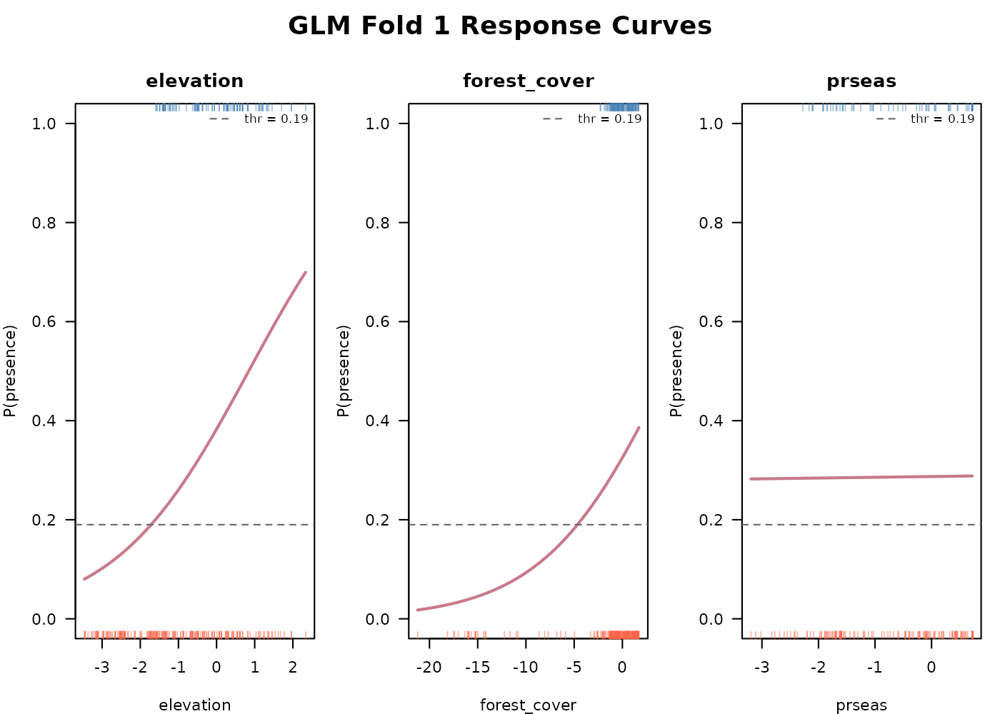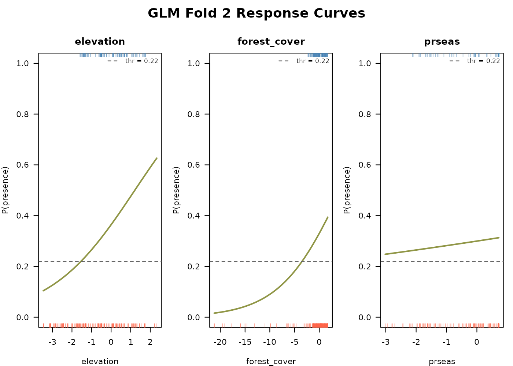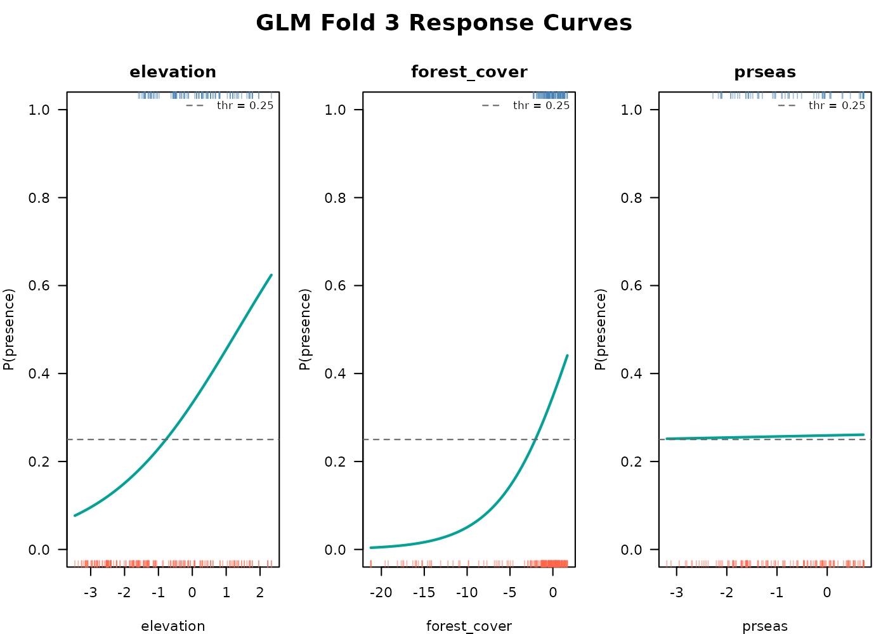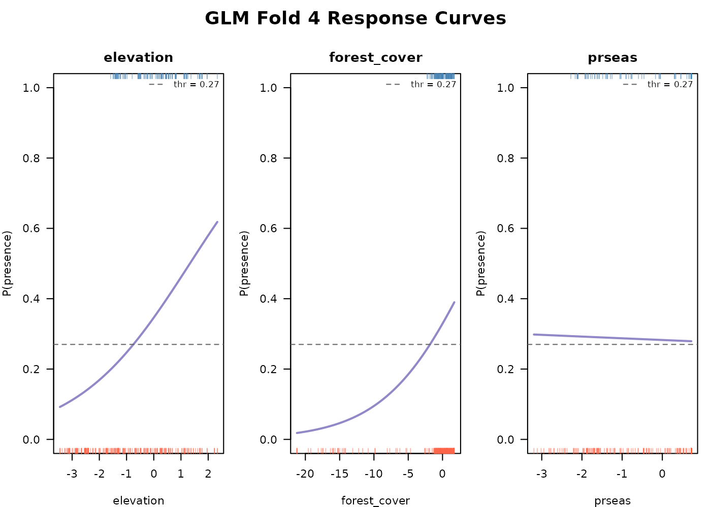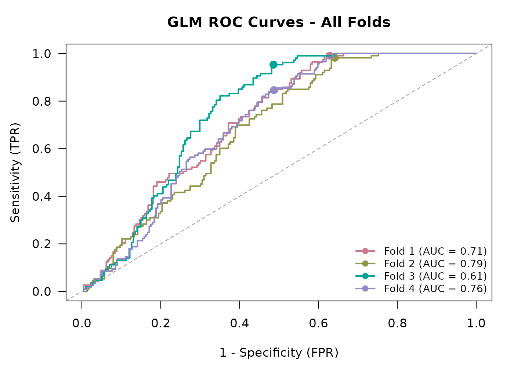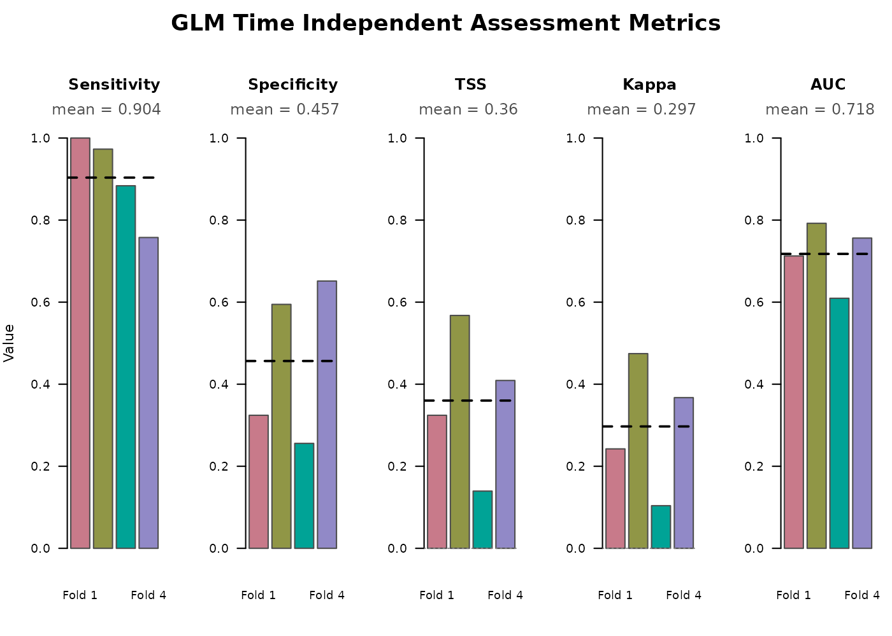

We see that our model correctly identifies a strong positive
relationship between both elevation and forest cover and species
occurance. The same `create_plot = TRUE` function also visualizes time
independent model assessment metrics relevant to the GLM. See [E-space
performance](#sec-espace).

``` r

class(glm_out)
#> [1] "TemporalGLM" "list"

names(glm_out)
#>  [1] "models"             "thresholds"         "threshold_method"  
#>  [4] "model_formula"      "link"               "model_vars"        
#>  [7] "fold_training_data" "fold_test_metrics"  "output_dir"        
#> [10] "model_type"         "plots"
```

The returned object is a list of class `"TemporalGLM"` containing the
following objects:

- `$models` — named list of `glm` objects, one per fold (`fold1`,
  `fold2`, …). Each is a standard `glm` fit and accepts R’s standard
  [`summary()`](https://rspatial.github.io/terra/reference/summary.html),
  [`coef()`](https://rdrr.io/r/stats/coef.html), and
  [`predict()`](https://rspatial.github.io/terra/reference/predict.html)
  calls.
- `$thresholds` — named numeric vector of probability thresholds used to
  binarise predictions for each fold.
- `$threshold_method` — character or numeric value recording how the
  thresholds were chosen (`"tss"`, `"prevalence"`, or a fixed numeric
  value).
- `$model_formula` — the right hand side formula supplied to the
  function.
- `$link` — the link function used (`"logit"`, `"probit"`, `"cloglog"`,
  or `"cauchit"`) supplied to the function.
- `$model_vars` — character vector of the predictor variable names
  extracted from the formula. Used by
  [`generate_spatiotemporal_predictions()`](../reference/generate_spatiotemporal_predictions.md)
  to know which raster layers to assemble at projection time.
- `$fold_training_data` — named list of the training data frames used
  for each fold, with presences and pseudoabsences combined and
  environmental columns attached.
- `$fold_test_metrics` — data frame of per-fold E-space metrics computed
  on the held-out test set. See [E-space performance](#sec-espace).
- `$output_dir` — path to the directory where the saved RDS of fitted
  models and the fold test metrics CSV were written.
- `$model_type` — `"glm"`, used by
  [`generate_spatiotemporal_predictions()`](../reference/generate_spatiotemporal_predictions.md)
  to choose the correct projection logic.
- `$plots` — list of recorded base-R plots produced when
  `create_plot = TRUE` (response curves and the fold metrics bar chart).

  

## Formula syntax

The response variable `presence` is added automatically to each formula,
so only the right-hand side needs to be supplied. Standard R formula
operators are valid: `+` for additive terms, `:` for interaction only,
`*` for main effects plus interaction,
[`I()`](https://rdrr.io/r/base/AsIs.html) for arithmetic
transformations, [`poly()`](https://rdrr.io/r/stats/poly.html) for
orthogonal polynomials, [`log()`](https://rdrr.io/r/base/Log.html),
[`sqrt()`](https://rdrr.io/r/base/MathFun.html), and so on. Variable
names must match column names in the data exactly. These examples that
all work:

``` r

### Additive
~ elevation + forest_cover + prseas

### Quadratic term on elevation
~ elevation + I(elevation^2) + forest_cover + prseas

### Orthogonal polynomial of degree 2 on elevation
~ poly(elevation, 2) + forest_cover + prseas

### Forest cover by precipitation interaction
~ elevation + forest_cover * prseas
```

If you choose a link other than logit, set it via the `link` argument.

  

## Threshold selection

GLMs produce probabilities on the 0–1 scale. The rest of the
TemporalModelR pipeline operates on binary suitability rasters, so a
probability threshold must be chosen to convert probabilities into 0/1
predictions. `threshold_method` supports three options:

- `"tss"` (default) — selects the threshold that maximises True Skill
  Statistic (sensitivity + specificity − 1) on the training data. See
  [E-space performance](#sec-espace). This balances commission and
  omission.
- `"prevalence"` — sets the threshold equal to the prevalence
  (proportion of presences) in the training data for that fold.
- A numeric value between 0 and 1 — used as a fixed threshold for all
  folds, e.g. `threshold_method = 0.4`.

The chosen thresholds for our four folds:

``` r

glm_out$thresholds
#> fold1 fold2 fold3 fold4 
#>  0.19  0.22  0.25  0.27
```

These are per-fold values because each fold trains on a different subset
of data and may end up with different probability distributions. Using a
single global threshold across folds risks underclassifying suitability
in some folds.

  

## E-space performance

Each fold’s held-out test set provides a set of presence and
pseudoabsence points the model has never seen based on the folds defined
in the [Preprocessing temporally explicit data](preprocessing.md)
vignette. We compare predicted vs observed at those points and compute
confusion-matrix metrics. Because these are evaluated in E-space (the
species’ environmental tolerance, independent of geography or time),
they give a stable picture of how well the model is preforming.

``` r

glm_out$fold_test_metrics
#>   Fold Threshold Testing_TP Testing_FN Testing_TN Testing_FP Sensitivity
#> 1    1      0.19         37          0         24         50      1.0000
#> 2    2      0.22         36          1         44         30      0.9730
#> 3    3      0.25         38          5         22         64      0.8837
#> 4    4      0.27         25          8         43         23      0.7576
#>   Specificity    TSS  Kappa    AUC
#> 1      0.3243 0.3243 0.2424 0.7126
#> 2      0.5946 0.5676 0.4746 0.7922
#> 3      0.2558 0.1395 0.1039 0.6095
#> 4      0.6515 0.4091 0.3673 0.7562
```

Columns:

- `Fold` — fold identifier matching the folds in
  `tmr_partition$points_sf$fold`.
- `Threshold` — the per-fold probability threshold used to binarise
  predictions.
- `Testing_TP` — count of test-set presence points correctly classified
  as suitable (true positives).
- `Testing_FN` — count of test-set presence points incorrectly
  classified as unsuitable (false negatives).
- `Testing_TN` — count of test-set pseudoabsence points correctly
  classified as unsuitable (true negatives).
- `Testing_FP` — count of test-set pseudoabsence points incorrectly
  classified as suitable (false positives).
- `Sensitivity` — proportion of test-set presences correctly classified,
  `Testing_TP / (Testing_TP + Testing_FN)`. Values close to 1 mean the
  model rarely misses presences.
- `Specificity` — proportion of test-set pseudoabsences correctly
  classified, `Testing_TN / (Testing_TN + Testing_FP)`. Values close to
  1 mean the model rarely flags pseudoabsence points as suitable.
- `TSS` — True Skill Statistic, `Sensitivity + Specificity - 1`. Ranges
  from -1 to 1, with 0 indicating performance no better than random and
  values above ~0.4 considered useful for most applications.
- `Kappa` — Cohen’s kappa statistic adjusting overall classification
  accuracy for the accuracy expected by chance. Ranges from -1 to 1 with
  similar interpretation to TSS.
- `AUC` — area under the ROC curve, computed on continuous probabilities
  rather than binarised predictions, so it is threshold-independent.
  Useful for comparing the models overall preformance independent of
  threshold.

The full ROC curve and each above metric are also graphed as an output
of `create_plot = T` in the [Fitting a temporal GLM](#sec-fit) section.

E-space metrics are robust to imbalanced sample sizes across time,
because they pool across the time series. They are a good metric for
assessing overall model fit. Time-specific (G-space) metrics can also be
assessed later when we project the model to spesific G-space and time
combinations.

  

## Projecting predictions

[`generate_spatiotemporal_predictions()`](../reference/generate_spatiotemporal_predictions.md)
projects each fold’s model onto a stack of environmental rasters
matching each requested time step, producing one fold-vote raster per
time step. The same call works for all four model types; `model_type` in
the model object tells the function which projection logic to use.

For this example we project across all 15 years and 4 seasons, producing
60 prediction layers total, each summarizing votes across the four
folds:

``` r

scaled_dir <- system.file("extdata/rasters_scaled", package = "TemporalModelR")

time_steps <- expand.grid(
  year             = 1:15,
  season           = c("Spring", "Summer", "Autumn", "Winter"),
  stringsAsFactors = FALSE
)

preds <- generate_spatiotemporal_predictions(
  partition_result     = tmr_partition,
  model_result         = glm_out,
  pseudoabsence_result = tmr_absences,
  raster_dir           = scaled_dir,
  variable_patterns    = c(
    "elevation"    = "elevation",
    "forest_cover" = "forest_cover_YEAR",
    "prseas"       = "prseas_YEAR_SEASON"
  ),
  time_cols            = c("year", "season"),
  time_steps           = time_steps,
  output_dir           = file.path(tempdir(), "GLM_Predictions"),
  overwrite            = TRUE,
  verbose              = FALSE
)
```

We can now visualize the 60 prediction rasters as a year-by-season grid.
Each cell shows the number of folds (0 to 4) that classified that pixel
as suitable.

[`terra::plot()`](https://rspatial.github.io/terra/reference/plot.html)
limits each call to 16 layers, so we render the stack in four blocks of
four years each.

``` r

pred_stack <- terra::rast(preds$prediction_files)

pred_names    <- basename(preds$prediction_files)
pred_seasons  <- sub(".*_(Spring|Summer|Autumn|Winter)\\.tif$", "\\1", pred_names)
pred_years    <- as.numeric(sub(".*_(\\d+)_(Spring|Summer|Autumn|Winter)\\.tif$",
                                "\\1", pred_names))
season_levels <- c("Spring", "Summer", "Autumn", "Winter")
stack_order   <- order(pred_years, match(pred_seasons, season_levels))

pred_stack <- pred_stack[[stack_order]]
ordered_years   <- pred_years[stack_order]
ordered_seasons <- pred_seasons[stack_order]
names(pred_stack) <- paste0("Y", ordered_years, "_", ordered_seasons)

block1 <- which(ordered_years %in%  1:4)
block2 <- which(ordered_years %in%  5:8)
block3 <- which(ordered_years %in%  9:12)
block4 <- which(ordered_years %in% 13:15)
```

``` r

terra::plot(pred_stack[[block1]], nr = 4, nc = 4,
            mar = c(1.0, 1.0, 1.5, 3.0),  legend = FALSE)
```

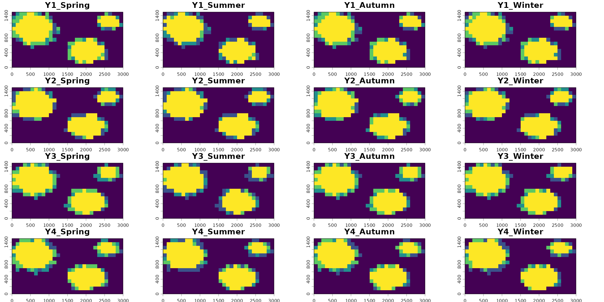

``` r

terra::plot(pred_stack[[block2]], nr = 4, nc = 4,
            mar = c(1.0, 1.0, 1.5, 3.0),  legend = FALSE)
```

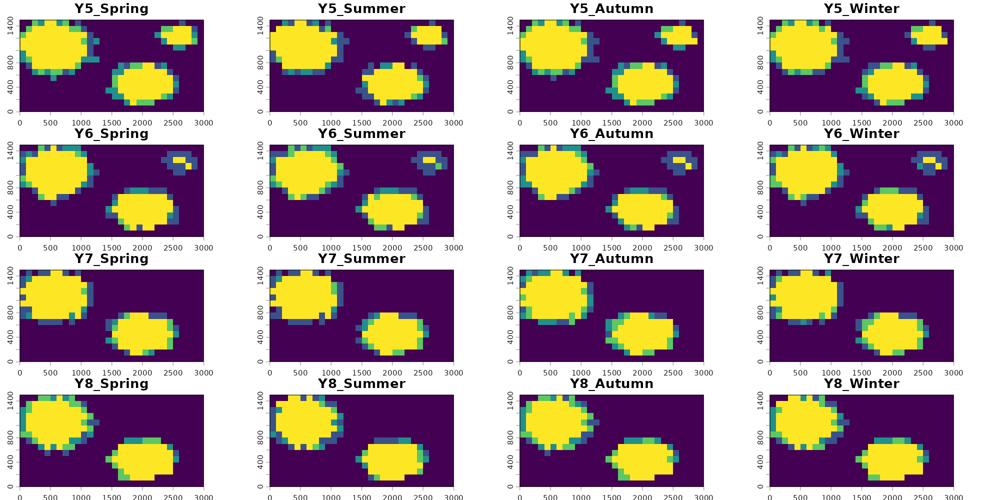

``` r

terra::plot(pred_stack[[block3]], nr = 4, nc = 4,
            mar = c(1.0, 1.0, 1.5, 3.0),  legend = FALSE)
```

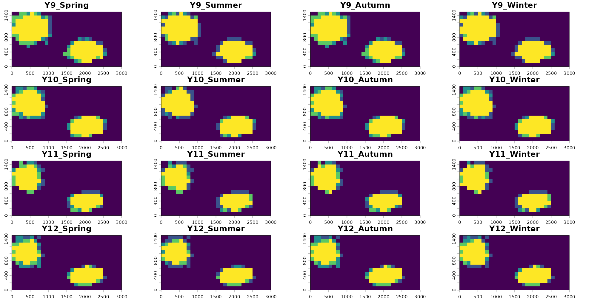

``` r

terra::plot(pred_stack[[block4]], nr = 3, nc = 4,
            mar = c(1.0, 1.0, 1.5, 3.0),  legend = FALSE)
```

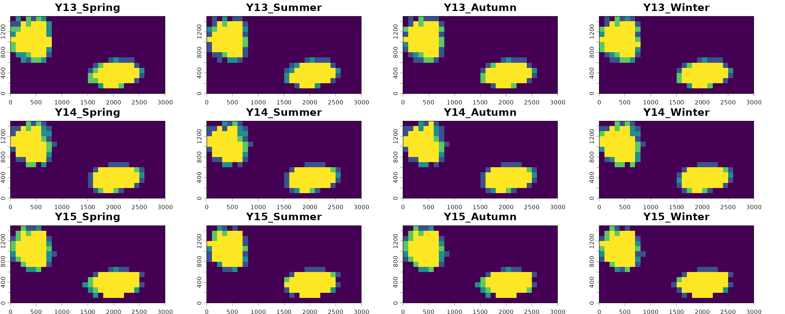

Visualizing our predictions across each season and year, we see that
there is generally high agreement among models. These rasters represent
consensus votes among each of our four folds, with yellow pixels having
strong positive consensus among all folds (all four identify the pixel
as suitbale) and blue pixels having low consensus among folds (few to no
folds identify the given pixel as suitable). We also see that the models
correctly visually show one of the main temporal trends in the data:
loss of habitat through deforestation starting around year 6.

The GLM here does not pick up on the seasonal variability in
precipitation patterns driving activity patterns for this hypothetical
species, partially because the model itself is missing the relationship
between precipitation and occupancy. This is in part due to the lack of
low precipitation value background points in our dataset which would
correctly identify the gap here. We can explore if other modeling
methods are able to fix this hurdle in other vignettes. Alternatively,
we could use an alternative method for generating absence points which
we describe more in the the [Preprocessing](preprocessing.md) vignette.

Note that here we show that `time_steps` can handle making predictions
from compound variables or variables at different temporal scales so
long as their temporal scales are nested. For example here “elevation”
has no temporal value and is considered to be static across all time
steps. “forest_cover” is measured annually, but is considered to be
static across all seasons within a year for the purposes of predictions.
“prseason” is measured both by year and season, so resulting seasonal
predictions reflect that. However if precipitation was only measured
based on aggregate seasons but had no associated year, predictios would
fail. Predictions can also be made where all variables share the same
time step- for example annuual forest cover, annual temprerature, and
annual precipitation.

Additionally, a plain vector like `time_steps = 1:15` produces one
prediction per value of the first time column; the other time columns
are filled in with every unique value present in the occurrence data. So
a vector input with `time_cols = c("year", "season")` would produce one
prediction per year-season combination observed in the data. A data
frame like the
[`expand.grid()`](https://rdrr.io/r/base/expand.grid.html) above gives
explicit control: any combination of values can be requested, including
ones not present in the occurrence data, as long as the matching rasters
exist (Such as Summer or Winter predictions).

  

## G-space performance

Once predictions are projected, per-time-step metrics become available.
These are computed by overlaying the held-out test points (presences
plus, optionally, pseudoabsences) on the prediction raster for each time
step they fall in and counting correct vs incorrect classifications.

``` r

head(preds$timestep_metrics)
#>   Fold Pct_Suitable N_Pres TP FN Sensitivity        CBP N_Abs TN FP Specificity
#> 1    1       0.4156      2  2  0         1.0 0.17268642     4  0  4         0.0
#> 2    2       0.3844      2  2  0         1.0 0.14779753     4  2  2         0.5
#> 3    3       0.3533      5  4  1         0.8 0.05039517    10  1  9         0.1
#> 4    4       0.2667      0 NA NA          NA         NA    NA NA NA          NA
#> 5    1       0.4067      0 NA NA          NA         NA    NA NA NA          NA
#> 6    2       0.3133      2  2  0         1.0 0.09817778     4  2  2         0.5
#>    TSS year season
#> 1  0.0    1 Spring
#> 2  0.5    1 Spring
#> 3 -0.1    1 Spring
#> 4   NA    1 Spring
#> 5   NA    2 Spring
#> 6  0.5    2 Spring
```

Columns:

- `Fold` — fold identifier; one row per fold per time step.
- `Pct_Suitable` — proportion of the study area predicted suitable in
  that time step.
- `N_Pres` — number of held-out presence test points falling in that
  time step for that fold.
- `TP` — true positives, presences correctly classified as suitable in
  that time step.
- `FN` — false negatives, presences incorrectly classified as unsuitable
  in that time step.
- `Sensitivity` — `TP / (TP + FN)` for that fold-time step.
- `CBP` — cumulative binomial probability. Under the null that each test
  point lands in suitable area at the rate `Pct_Suitable`, this is the
  probability of observing exactly `TP` correctly classified points by
  chance. Small values indicate predictions are better than random.
- `N_Abs` — number of held-out pseudoabsence test points falling in that
  time step. `NA` for presence-only models.
- `TN` — true negatives, pseudoabsences correctly classified as
  unsuitable.
- `FP` — false positives, pseudoabsences incorrectly classified as
  suitable.
- `Specificity` — `TN / (TN + FP)` for that fold-time step.
- `TSS` — `Sensitivity + Specificity - 1` for that fold-time step.
- `year` and `season` — the values of `time_cols` for that row,
  identifying which time step the metrics belong to.

G-space metrics are powerful in time steps with substantial sample sizes
but lose meaning when few records exist (as with out example). A fold
with only one presence in a given year can score sensitivity 0 or 1 with
no real information content. Likewise, the ability to earn a significant
G-space CBP score explicitly depends on sample size. Report E-space
(from `$fold_test_metrics`) and G-space (from `$timestep_metrics`)
together for a complete view of model performance.

The overall summary gives a per-fold summary across all time steps:

``` r

preds$overall_summary
#>   Fold N_Timesteps Mean_Pct_Suitable Total_TP Total_FN Overall_Sensitivity
#> 1    1          60            0.3336       37        0              1.0000
#> 2    2          60            0.2686       36        1              0.9730
#> 3    3          60            0.2673       38        5              0.8837
#> 4    4          60            0.2303       25        8              0.7576
#>    Overall_CBP Total_TN Total_FP Overall_Specificity Overall_TSS
#> 1 2.275703e-18       24       50              0.3243      0.3243
#> 2 7.575386e-20       44       30              0.5946      0.5676
#> 3 3.420081e-17       22       64              0.2558      0.1395
#> 4 1.958217e-10       43       23              0.6515      0.4091
```

Rapid visual assessment of these metrics can be done using the function
[`plot_model_assessment()`](../reference/plot_model_assessment.md) which
generates simple summary plots for each.

``` r

plot_model_assessment(
  predictions         = preds,
  time_column         = c("year", "season"),
  secondary_time_mode = "combine",
  model_result        = glm_out
)
#> Loaded fold_test_metrics for 4 fold(s).
```

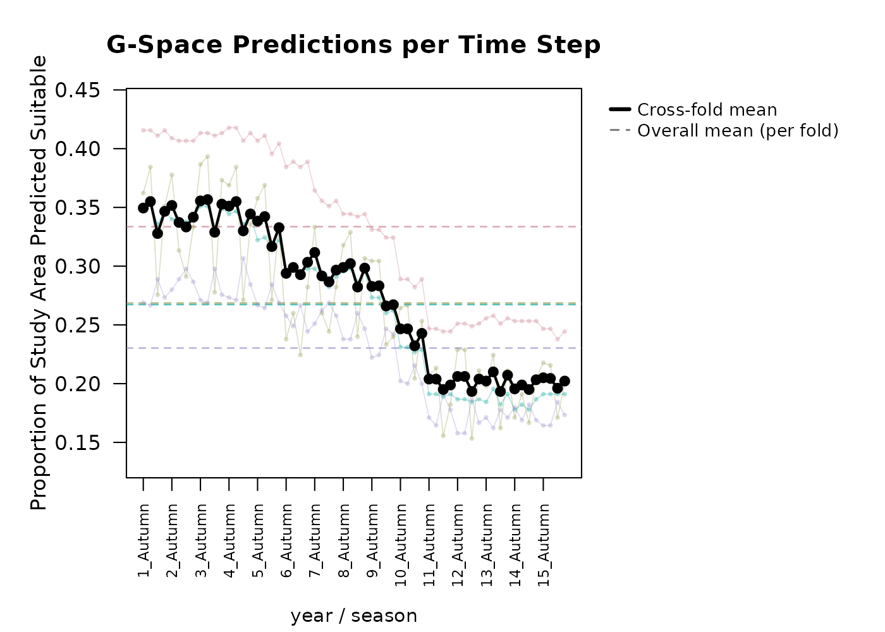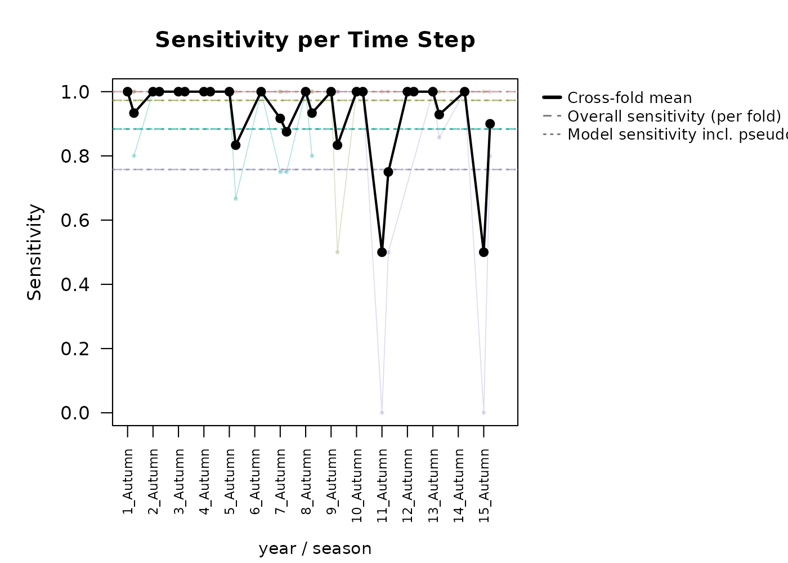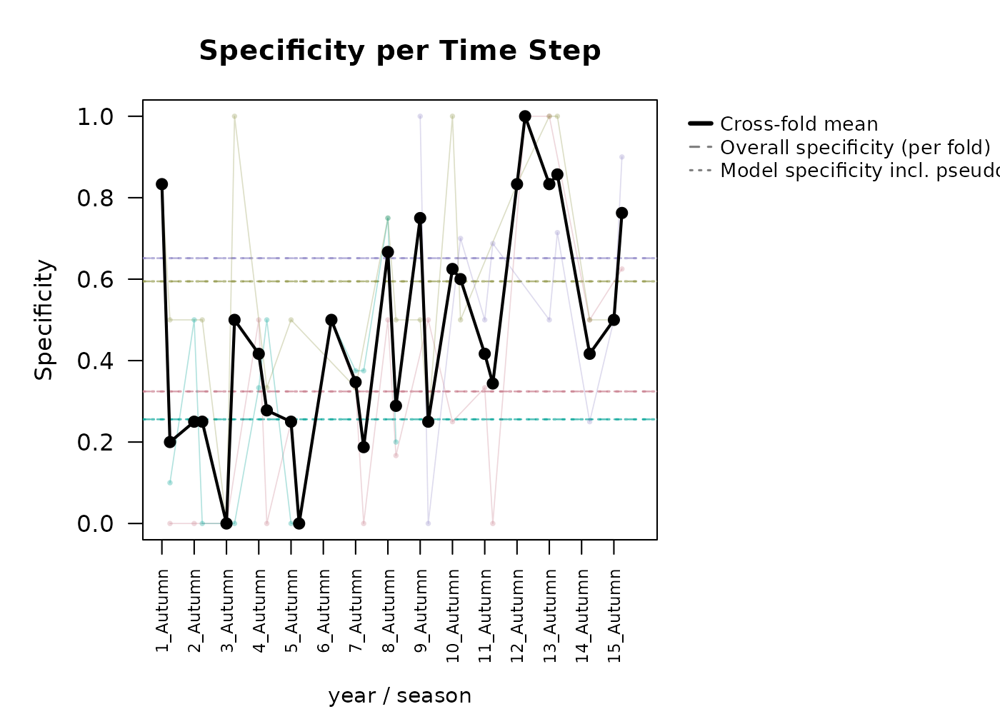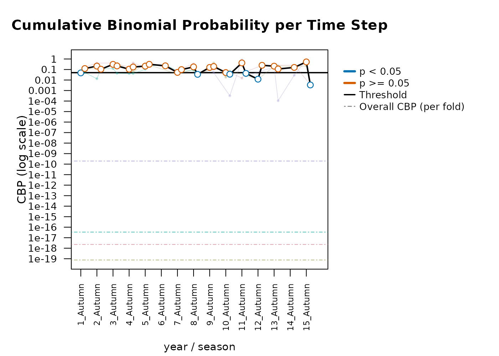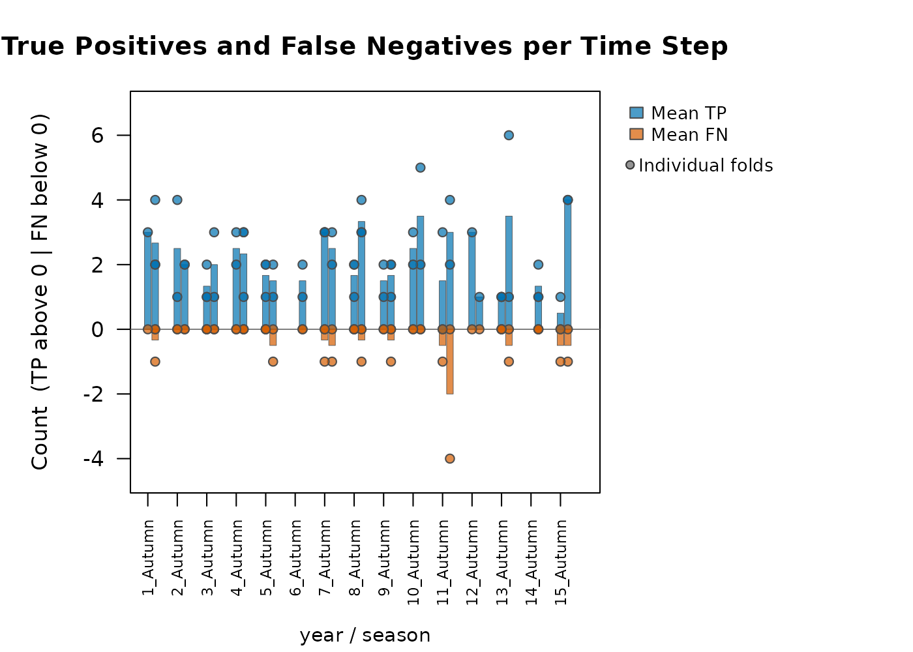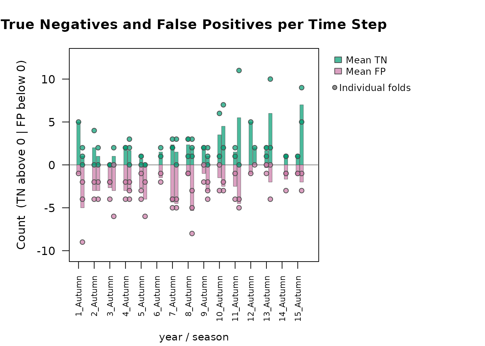

    #> 
    #> Timestep assessment summary.
    #>          Metric    Mean     SD
    #>    Pct_Suitable  0.2749 0.0731
    #>     Sensitivity  0.9274 0.2026
    #>     Specificity  0.4314 0.3207
    #>  CBP < 0.05 (%) 30.2000     NA

This produces per-fold time series of percent suitable, sensitivity,
specificity, CBP, TP/FN, and TN/FP. When `model_result` is also
supplied, overall sensitivity and specificity from `$fold_test_metrics`
are added as reference lines. When compound time steps are used (such as
year and season), you must choose how they are visualized. Choosing
`secondary_time_mode = "combine"` will roll them into one continuous x
axis. `secondary_time_mode = "facet"` produces stacked plots as seen
below, where the first `time_col` is displayed as the x axis, and a
differnt plot is made for each secondary variable (`season` here). By
default, the threshold for which CBP is identified as signifcant is
0.05, but this may also be adjusted mannually.

``` r

plot_model_assessment(
  predictions         = preds,
  time_column         = c("year", "season"),
  secondary_time_mode = "facet",
  model_result        = glm_out,
  cbp_threshold       = 0.001
)
#> Loaded fold_test_metrics for 4 fold(s).
```

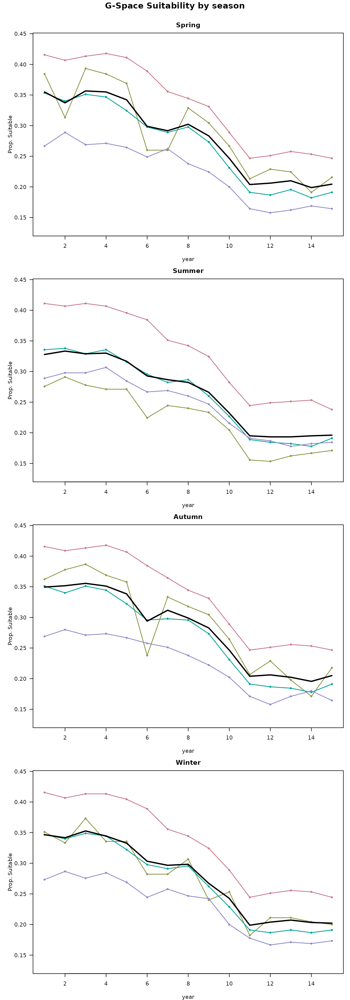

    #> Facet mode: produced 4 stacked plot(s) across 4 season value(s).

  

## Next steps

Now that predictions have been generated, you can assess the model and
see if it is preforming satisfactory enough for what your goals are. If
this is the case, you can preform postprocessing analyses to try to gain
additional inference about the spatiotemporal patterns of change in the
study region See the [Postprocessing predictions](postprocessing.md)
vignette.

For comparison with other algorithms applied to the same dataset:

- [Modeling with a GAM](modeling_gam.md) — smooth nonlinear responses.
- [Modeling with a Random Forest](modeling_rf.md) — flexible ensemble of
  decision trees for complicated relationships to variables.
- [Modeling with a Hypervolume](modeling_hv.md) — presence-only modeling
  using n-dimensional kernel density or one-class SVM.
